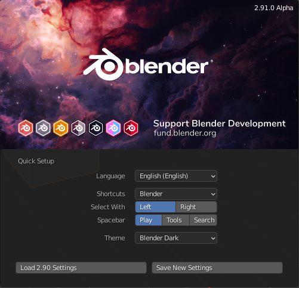
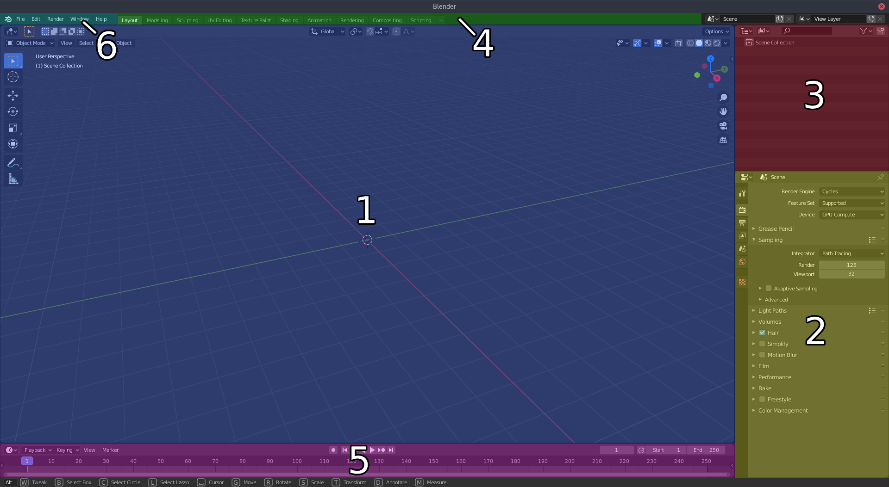
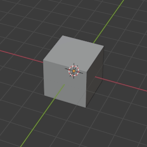
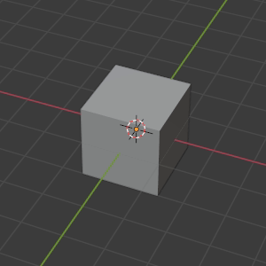
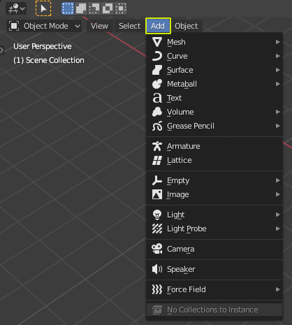
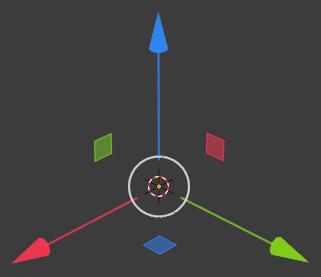
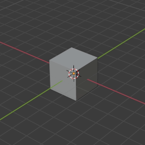
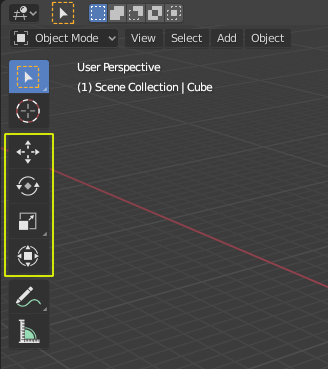
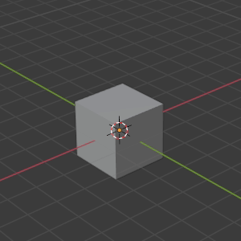

###########
First Steps
###########

*************
First startup
*************
During the first blender startup it will ask you for some basic settings.
Choose the following to guarantee we all have the same setup and that
instructions in the next chapters are accurate.

In case you already started Blender before or chose the wrong settings by
accident, you can either change them in blender preferences or set everything
back to the state it's in before the first blender startup by deleting the
**userprefs.blend file** in blenders Application Settings.

Changing the settings in the blender preferences
================================================
| Open the blender preferences by clicking on **Edit (Topbar Menu) >> Preferences...**.
| You can also open them by pressing **F4 then pressing >> Preferences...**.

| Language Setting:
| **Preferences >> Interface**

| Shortcuts:
| **Preferences >> Keymap**

| Themes:
| **Preferences >> Theme**

Images (Click for fullsize)
    .. image:: ../_static/images/bl_preferences_language.png
        :width: 300

    .. image:: ../_static/images/bl_preferences_keymap.png
        :width: 300

    .. image:: ../_static/images/bl_preferences_themes.png
        :width: 300

Resetting blender application settings
======================================
Delete the **userprefs.blend** file in the config folder in the blender
application settings folder. Blender application settings folder paths
for each operating system are listed below.

Blender application settings locations:
    * :ref:`app-settings-location-win`
    * :ref:`app-settings-location-linux`
    * :ref:`app-settings-location-macos`

*************************************
General User Interface (GUI) Overview
*************************************
This overview lists the most prevalent user interface elements so you get an understanding of the basic building blocks of blender. 
We will use the Layout Workspace in this overview because in the beginning we will spend most of our time in this Workspace.

.. note::
    **Further chapters will use the names listed below, so learn them by heart.**

Interface Sections names:
    #. **Main Panel (3D Viewport)** [Blue]
    #. **Properties Panel** [Yellow]
    #. **Outliner Panel** [Red]
    #. **Workspace List** [Green]
    #. **Timeline Panel** [Pink]
    #. **Topbar Menu** [Teal]

**********************
3D Viewport Navigation
**********************
This section describes basic 3D Viewport navigation shortcuts for blender. These
are needed for very basic scene navigation and can be adjusted to work like navigation
does in other 3D Software packages, but we will describe the blender defaults here.

================================ ================================= =============================
Orbiting the Camera/Viewport     Panning the Camera/Viewport       Dollying the Camera/Viewport
================================ ================================= =============================
|nav_orbit|                      |nav_pan|                         |nav_zoom|
Key Combination:                 Key Combination:                  Key Combination:
**MiddleMouse-Drag**             **MiddleMouse-Drag + Shift**      **MiddleMouse-Drag + Ctrl** or **MouseWheel**
================================ ================================= =============================

.. |nav_orbit| image:: ../_static/images/bl_viewnav_orbit.gif
    :alt: Shows animation of the camera orbiting around a cube in blenders 3D viewport

*********************************
Settings up a better startup file
*********************************
The default blender startup file contains the legendary default cube, a camera,
and a sun lamp object. If you look at the *Outliner* on the right hand side you
will see, that all these objects are grouped inside a Collection named
'Collection' (very creative).

Most of the time we will just delete these objects and the Collection when we
fire up blender. So we will save a completely empty startup file to save us
some time at the start of every blender session.

#. Delete the Cube, Camera and Sun Lamp by **LeftClick-Drag boxselecting** them
   in the *3D Viewport* and press **Hotkey: X** or **Hotkey: Del** to delete them
   from the scene.
#. Remove the now empty Collection "Collection" by selecting it in the Outliner
   and hit **Hotkey: X** or **Hotkey: Del** while hovering the mouse over the
   outliner to delete it.
#. Use the *File Topbar-Menu* and navigate to **File >> Defaults >> Save Startup File.**
   Click it to save the current file and it's state as default file that gets loaded
   everytime you open blender or create a new file.

.. note::
    Hovering the Mouse over the specific panel we want to make an action happen
    in is **very important** in blender. **As focus switches to the panel the mouse is
    hovering over!.**

***************
Object Creation
***************
To create objects in the 3D Viewport you need to open the **Add-Menu in the top
left corner of the 3D Viewport.** The Add-Menu contains all createable objects
and is your one-stop-shop for adding objects to your current scene.

You can also press the **Hotkey: Shift + A** to open the Add-Menu right where 
your mousecursor is for quicker access.

*******************
Object Manipulation
*******************

Blender has featured gizmo less object manipulation for a very long time, but
this mode of object manipulation without a 3D-Axis-Gizmo is not very common
and might be a feature that takes some time getting used to if you're coming
from other 3D Apps. For this reason the 2.80 version of blender also added
the option to use 3D-Axis-Gizmos for object manipulation.

If you're asking yourself *"WTF is a Gizmo?"* right now, then dont worry. This is
a gizmo (Translation/Move Gizmo):

Manipulation without Gizmo
==========================
Manipulation without Gizmo is hotkey driven. The Hotkeys for each manipulation
mode are shown below. After activation of Grab, Rotate or Scale Mode you can
constraint the transformation to a single axis by pressing **Hotkey: X, Y or Z**
while the tool is active. 

If you want to constraint the transformation to one of
the 3D-Planes (XY-Plane, XZ-Plane, YZ-Plane) you can press **Hotkey: Shift + X|Y|Z**
to constrain to the 3D-Plane that doesn't contain the Axis you pressed. Think of it
as if you are exlcuding the Axis from the transform. 

>> **Example**: Pressing **Shift + Z** will constrain to the XY-Plane

====================================== ====================================== ======================================
Grabbing/Moving the Object             Rotating the Object                    Scaling the Object
====================================== ====================================== ======================================
|manip_move|                           |manip_rotate|                         |manip_scale|
Key Combination:                       Key Combination:                       Key Combination:
**G + Mouse-Drag**                     **R + Mouse-Drag**                     **S + Mouse-Drag**
After the Tool is active:              After the Tool is active:              After the Tool is active:
**X, Y, Z for Axis constraints**       **X, Y, Z for Axis constraints**       **X, Y, Z for Axis constraints**
**Shift + X|Y|Z for Plane constraint** **Shift + X|Y|Z for Plane constraint** **Shift + X|Y|Z for Plane constraint**
**RightMouse to Cancel the transform** **RightMouse to Cancel the transform** **RightMouse to Cancel the transform**
====================================== ====================================== ======================================

.. note::
    While gizmoless object manipulation might take some time getting used to
    it is way faster than using a gizmo to manipulate objects in almost all cases.

Manipulation with Gizmo
=======================
If you want to use a 3D-Axis-Gizmo for object translation, rotation and scale
instead you can find them on in the *Toolbar* on the left side of the *3D Viewport*.
As marked in the image below there are four 3D-Axis-Gizmo tools available. A Move,
a Rotate, a Scale and a Transform Gizmo which combines Move, Rotate and Scale into
one Gizmo for quicker access to the different transform modes.

============== ================= ======================================
Gizmo          Demo              Hotkeys
============== ================= ======================================
Move-Tool      |gizmo_move|      **RightMouse to cancel the transform** 
Rotate-Tool    |gizmo_rotate|    **RightMouse to cancel the transform**  
Scale-Tool     |gizmo_scale|     **RightMouse to cancel the transform**   
Transform-Tool |gizmo_transform| **RightMouse to cancel the transform** 
============== ================= ======================================

