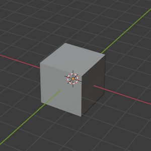

###########
First Steps
###########

*************
First startup
*************

During the first blender startup it will ask you for some basic settings.
Choose the following to guarantee we all have the same setup and that
instructions in the next chapters are accurate.

.. image:: ../_static/images/bl_quick_setup_options.png

In case you already started Blender before or chose the wrong settings by
accident, you can either change them in blender preferences or set everything
back to the state it's in before the first blender startup by deleting the
**userprefs.blend file** in blenders Application Settings.

Changing the settings in the blender preferences
================================================

| Open the blender preferences by clicking on **Edit (Topbar Menu) >> Preferences...**.
| You can also open them by pressing **F4 then pressing >> Preferences...**.

| Language Setting:
| **Preferences >> Interface**

| Shortcuts:
| **Preferences >> Keymap**

| Themes:
| **Preferences >> Theme**

Images (Click for fullsize)
    .. image:: ../_static/images/bl_preferences_language.png
        :width: 300

    .. image:: ../_static/images/bl_preferences_keymap.png
        :width: 300

    .. image:: ../_static/images/bl_preferences_themes.png
        :width: 300

Resetting blender application settings
======================================

Delete the **userprefs.blend** file in the config folder in the blender
application settings folder. Blender application settings folder paths
for each operating system are listed below.

Blender application settings locations:
    * :ref:`app-settings-location-win`
    * :ref:`app-settings-location-linux`
    * :ref:`app-settings-location-macos`

*************************************
General User Interface (GUI) Overview
*************************************

This overview lists the most prevalent user interface elements so you get an understanding of the basic building blocks of blender. 

.. note::
    **Further chapters will use the names listed below, so learn them by heart.**

Interface Sections names:
    #. Main Panel (3D Viewport)
    #. Properties Panel
    #. Outliner Panel
    #. Workspace List
    #. Timeline Panel
    #. Topbar Menu

*******************
Viewport Navigation
*******************

This section describes basic 3D Viewport navigation shortcuts for blender. These
are needed for very basic scene navigation and can be adjusted to work like navigation
does in other 3D Software packages, but we will describe the blender defaults here.

================================ ================================= =============================
Orbiting the Camera/Viewport     Panning the Camera/Viewport       Zooming/Dollying the Camera/Viewport
================================ ================================= =============================
|nav_orbit|                      |nav_pan|                         |nav_zoom|
Key Combination:                 Key Combination:                  Key Combination:
**MiddleMouse**                  **MiddleMouse + Shift**           **MiddleMouse + Ctrl** or **MouseWheel**
================================ ================================= =============================

.. |nav_pan| image:: ../_static/images/bl_viewnav_pan.gif

