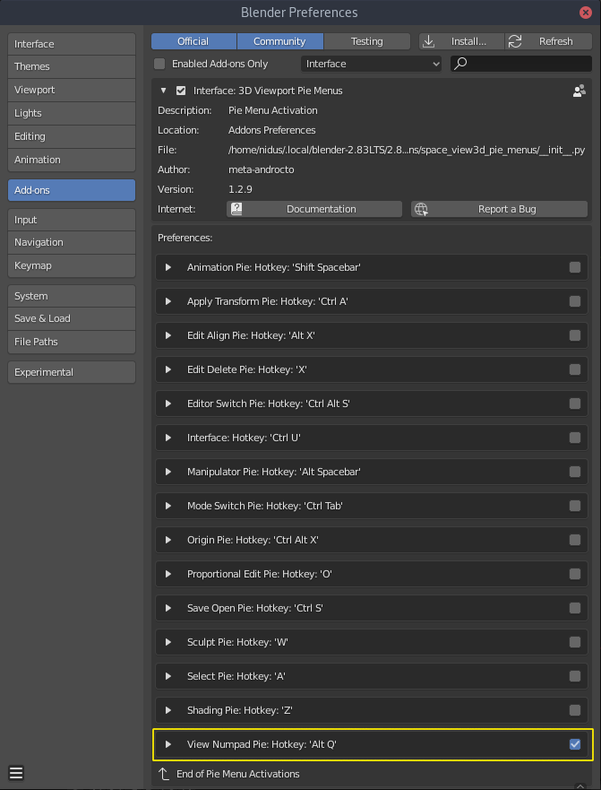
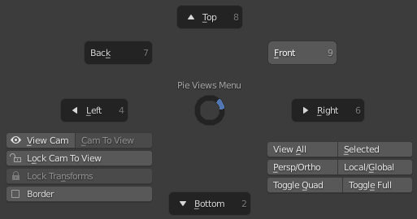

########
Lesson 1
########

***********************************
Selection, Duplication and Snapping
***********************************

Selection
=========
Object selection is explained very well in the official blender manual:

Blender Manual Link:
    `Blender Manual | Selecting <https://docs.blender.org/manual/en/latest/interface/selecting.html>`_

Active Object
-------------
The active object is the object which properties are displayed in the **Properties Panel**.
It is often the last selected object, which makes selection order important because many
operators pay special attention to the active object versus the other selected objects.

Duplication
===========
To duplicate the seleced object simply press **Shift + D**. Blender will duplicate all
selected objects and put you into the gizmoless Move/Grab Object(s) mode where you can either
place the object(s) where you want or cancel the transformation by clicking **RightMouse-Button**.
The duplicate object will then be in the same position as the original and overlap it.

For more information please refer to the official blender manual:

Blender Manual Link:
    `Blender Manual | Duplicate <https://docs.blender.org/manual/en/latest/scene_layout/object/editing/duplicate.html>`_

Snapping
========
Snapping helps you place object more accurately by automatically aligning object features
to each other. The Blender manual is very thorough on this topic and explains it very well.

Blender Manual Link:
    `Blender Manual | Snapping <https://docs.blender.org/manual/en/latest/editors/3dview/controls/snapping.html>`_

*******************************
Viewport Hotkeys and the Numpad
*******************************
A lot of blenders functionality is bound to the number keys on the numpad.
Orthographic views, Isolation mode, Zoom to selected object, are all functions
that are bound to numpad keys.

============ ==========================================================================
Hotkey       Function
============ ==========================================================================
**Numpad 1** Front Orthographic Viewport
**Numpad 2** Rotate Viewport Down
**Numpad 3** Right Orthographic Viewport
**Numpad 4** Rotate Viewport Left
**Numpad 5** Toggle between Perspective and Orthographic Viewport
**Numpad 6** Rotate Viewport Right
**Numpad 7** Top Orthographic Viewport
**Numpad 8** Rotate Viewport Up
**Numpad 9** Toggle Opposing Orthographic Viewport (Top/Bottom, Right/Left, Front/Back)
**Numpad .** Zoom to selected objects
**Numpad /** Isolate selected objects
**Numpad -** Zoom out
**Numpad +** Zoom in
============ ==========================================================================

For Those without Numpads
=========================
Now if you don't have a numpad because you are on a laptop or using a 60% or 80% keyboard,
which are all missing the numpad, you can activate an addon that ships with blender
to access all that functionality via a PIE-Menu.

Activating the Viewport Pie Menu addon
--------------------------------------
* **Edit >> Preferences...** or **F4 >> Preferences...**
* Open the **Add-ons** tab by clicking on it on the left hand side
* Use the search bar on the left to lookg for the **3D Viewport Pie Menus Addon**
* Activate it by ticking on the **checkbox on the left of the Addon Entry**
* Open the Addons Preferences by **clicking on the little triangle arrow left of the checkbox**
* Disable/Uncheck all menus listed in the preferences except the very last one

.. note:: 
    After activating the addon and the **View Numpad Pie** you can call it up around your mouse
    by pressing **[Hotkey: Alt + Q]**

