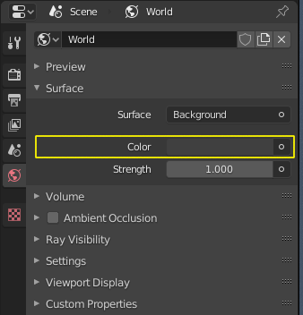

#####################
Lesson 1 - Primitives
#####################

The goal of this lesson is to create a cyberpunk/scifi city block by arranging simple primitives.
Basic Material creation and assignment to the primitives and simple lighting are also part of this
exercise. The result should come somewhat close to the example below.

Exercise Naming Convention
    | Name every file you turn in for the assignment with the following naming convention:
    | **lesson1_firstname_lastname.ext** (where .ext is the file extension e.g. .jpg, .png, .blend)

Exercise submission:
    * **Render 1080x1080 PNG-File (Eevee)**

*****************************
Tools needed for the exercise
*****************************

Selection
=========
| Object selection is explained very well in the official blender manual so refer to it for a detailed explanation. 
| Here is a short table to get you started on the basics.

=========================== ==========================================
Hotkey                      Function
=========================== ==========================================
**LMouse**                  Select an object
**Shift + LMouse**          Add or remove object from selection
**Ctrl + LMouse-BoxSelect** Remove box selected objects from selection
=========================== ==========================================

Blender Manual Link:
    `Blender Manual | Selecting <https://docs.blender.org/manual/en/latest/interface/selecting.html>`_

Active Object
-------------
The active object is the object which properties are displayed in the **Properties Panel**.
It is often the last selected object, which makes selection order important because many
operators pay special attention to the active object versus the other selected objects.

Duplication
===========
To duplicate the selected object simply press **Shift + D**. Blender will duplicate all
selected objects and put you into the gizmoless Move/Grab Object(s) mode where you can either
place the object(s) where you want or cancel the transformation by clicking **RightMouse-Button**.
The duplicate object will then be in the same position as the original and overlap it.

.. tip::
   If you want to rapidly duplicate objects you can repeat your last duplication and move
   by pressing **Hotkey: Shift + R** (This hotkey will repeat the last action you performed)

   .. figure:: ../_static/images/bl_ops_repeat_last.gif
      :figwidth: 300

      Duplication (Shift + D) and move followed by Repeat Last (Shift + R)

For more information please refer to the official blender manual:

Blender Manual Link:
    `Blender Manual | Duplicate <https://docs.blender.org/manual/en/latest/scene_layout/object/editing/duplicate.html>`_

Snapping
========
Snapping helps you place an object more accurately by automatically aligning object features
to each other. The Blender manual is very thorough on this topic and explains it very well.

============================= ==============================================================
Hotkey                        Function
============================= ==============================================================
**Ctrl** (while transforming) Holding down Ctrl enables snapping until you release it again
**Shift + Tab**               Enables or Disables Snapping globally
**Ctrl + Shift + Tab**        Opens the Snap settings as a floating panel next to your mouse
============================= ==============================================================

Blender Manual Link:
    `Blender Manual | Snapping <https://docs.blender.org/manual/en/latest/editors/3dview/controls/snapping.html>`_

The 3D Cursor
=============
The 3D Cursor is unique to blender and can speed up your workflow quite a bit.
You can position it by holding **Shift + RMouse** and draging in the 3D View.
You can even use snapping to snap it to object features.

Positioning the cursor has quite a few benefits. When you add objects to your
scene you can choose to spawn them at the cursor position instead of at the
world center. You can also use the cursor as a transform, rotation or scaling
center instead of the objects center of mass (Pivot Point).

.. tip:: 
   Quickly changing the pivot point is done by pressing **Hotkey: . (Dot)** on
   your keyboard which will open the Pivot Point Pie Menu (shown below).

   .. image:: ../_static/images/bl_gui_pivotpoint_pie.png

Blender Manual Links:
    `Blender Manual | 3D Cursor <https://docs.blender.org/manual/en/latest/editors/3dview/3d_cursor.html>`_
    `Blender Manual | Pivot Point <https://docs.blender.org/manual/en/latest/editors/3dview/controls/pivot_point/index.html>`_

*********
Materials
*********
.. note::
    To be able to see materials in our **3D Viewport** we need to make sure we
    are in the proper **Viewport Shading Mode**. Materials are only getting
    displayed in **Material Preview Mode** and **Rendered Preview Mode**.
    The buttons to switch between the different shading modes are in the 
    top right corner of the **3D Viewport**

    .. image:: ../_static/images/bl_gui_3dview_viewportshadingmodes.png

    **In order left to right:**

    #. **Wireframe** (Only Mesh edges visible) 
    #. **Solid** (Object surfaces visible shaded in grey)
    #. **Material Preview** (Shows Materials in a default light setup and is active in the screenshot above)
    #. **Rendered Preview** (Shows Materials affected by our Scene Lights)

Assigning New Materials to objects
==================================
To assign a material to an object click on it in the 3D View and then open the
|props_material| **Material Properties** panel. You can add a new material to
the object by clicking on the **New** Button highlighted in the image below.

A **Principled BSDF Shader Material** will be assigned to your object. You
can change its name in the text input highlighted in the image below.

.. note::
    For now we will ignore almost all of the settings on the material and just
    use **BaseColor** (also highlighted below) to change our object color.

.. |props_material| image:: ../_static/images/bl_gui_props_material.png

Assigning existing Materials
============================
I recommend naming all your materials and reuse them as much as possible,
both because it doesn't clutter up your scene and also makes edits to the
materials faster, if you have the same material assigned to multiple objects.

To assign an existing material to an object click the Material dropdown
Button (shown below) and choose one of the materials from the list that pops up.

.. tip::
   If you have a lot of objects that you want to assign the same material to
   you can do that in a single step aswell.

    #. Select all Objects you want to apply the material to (Shift + LMouse)
    #. Select an object that has the material applied you want to apply to all other objects
    #. Press **Hotkey: Ctrl + L** and select **Material**

    .. image:: ../_static/images/bl_make_links_material.gif

Emissive/Glowing Materials
==========================
To change a default **Principled BSDF Material** to a glowing/emissive **Emission Material**
simply click on the **Surface Slot** of the material and change its surface type
to **Emission** like in the image below. Adjust the Materials color and glow
strength to your liking.

.. image:: ../_static/images/bl_gui_props_material_emission.png

********
Lighting
********

Light sources
=============
You can use any of the Light objects listed in the **Add Menu (Shift + A) >> Light Category**
to light your cityscape. For more information on the different light types consult
the official blender manual linked below.

**Light sources available:**

* Point Light (Use for spherical light sources)
* Sun / Directional Light (Great for distant light sources like sun or moon)
* Spot Light (Cone shaped directed light, great for car headlights and other directional lights)
* Area Light (Softbox light, very smooth and diffuse shadows the larger the light source)

The **Settings for a Light Object** can be found in the |props_object_data_light| **Object Data Properties**
which are located in the **Properties Panel** on the right hand side of the Blender UI.

Blender Manual Link:
    `Blender Manual | Light Objects <https://docs.blender.org/manual/en/latest/render/lights/light_object.html>`_

The World Environment
=====================
The **World Environment** also factors into how our scene gets lit. You can adjust
your Worlds settings by navigating to the |props_world| **World Properties** 
located in the **Properties Panel** on the right hand side of Blenders UI.
I recommend settings this to a dark blue color to simulate a night scene for the
assignment for this lesson.

Blender Manual Link:
    `Blender Manual | World <https://docs.blender.org/manual/en/2.79/render/cycles/world.html>`_

*********
Rendering
*********

Interactive Preview
===================
To get an idea of what your end result will look like while you are working on it
and adjusting your settings. You can switch the **3D Viewport** to **Rendered Preview**
by clicking the rightmost button in the **3D Viewport Shading menu in the top 
right of the 3D Viewport** (Shown below).

You can also change to **Rendered Preview** by pressing **Hotkey: Z** on your
keyboard to open the **Shading Pie Menu** and choose the **Rendered** option.

Camera
======
To be able to make a final render we will need a camera in our scene that is set
as default scene camera.

Add one by pressing **Shift + A >> Camera** if this is the first camera you are
adding to the scene it will automatically be set as default scene camera.

**Useful hotkeys for Camera usage:**

===================== =========================================================================
Hotkey                Function
===================== =========================================================================
Numpad 0              Look through the **Scene Camera** (pressing it again returns to viewport)
Ctrl + Numpad 0       Sets the current object as **Scene Camera**
Ctrl + Alt + Numpad 0 Aligns the selected camera to the viewport
===================== =========================================================================

    Location of the Align Active Camera to View command (Hotkey: Ctrl+Alt+Numpad0) in the **3D Viewports View Menu**

.. note::
    | If you have another camera in the scene and want to switch the default scene camera to your new one.
    | Open the |props_scene| **Scene Properties** in the **Properties Panel** and set it to the camera you want.

    .. image:: ../_static/images/bl_gui_props_scene_camera.png

Output settings
===============
To set the output render size you will have to visit the |props_output| **Output Properties** Panel in the **Properties Panel**.

**Set it to 1080x1080 pixels for this assignment**

Render Settings
===============
We are rendering with the **EEVEE Realtime Render engine** so make sure it is set by
opening the |props_render| **Render Properties** in the **Properties Panel**
and setting the **Render Engine:** to **EEVEE**

EEVEE's Render settings are then listed below in the same panel, where you can tweak
its settings to your liking. I recommend enabling:

* **Bloom**
* **Ambient Occlusion**
* **ScreenSpace Reflections**
* **Increasing Shadow Map resolution (If your pc can handle it)**

Blender Manual Link:
    `Blender Manual | Eevee <https://docs.blender.org/manual/en/latest/render/eevee/index.html>`_

.. |props_render| image:: ../_static/images/bl_gui_props_render.png

**Finally** we can start rendering our image by pressing **F12** or by selecting **Render >> Render Image** in the **Topbar Menus**
