#################################
Lesson 2 - Simple Object Modeling
#################################

This time we are modeling simple everyday objects that you got on your
desk at home or floating around in your house. We will learn the most
often used modeling tools and other basic techniques that will enable
you to complete this assignment. We will also check out the **Principled
BSDF Material** a little bit more.

.. tip::
    If you need some inspiration for objects to model check out this
    `Random Object Generator <https://www.bestrandoms.com/random-item-generator>`_

This assignment is inspired by the amazing photography Carl Kleiner did for `Clas Ohlson <https://www.studiokleiner.com/commission/clas-olhson/>`_ , `FLOS <https://www.studiokleiner.com/commission/flos/>`_ and other floating object photography.

**************
What is a Mesh
**************
A polygonal mesh is made up of **vertices, edges and faces**. Together they form a 
3-dimensional solid object with flat polygonal faces, straight edges and sharp corners
(also known as a **polyhedron**). With these basic building blocks it is possible
to create quite complex geometry and there exist algorithms that allow us to subdivide
these meshes into smaller polygons to get very smooth looking surfaces.

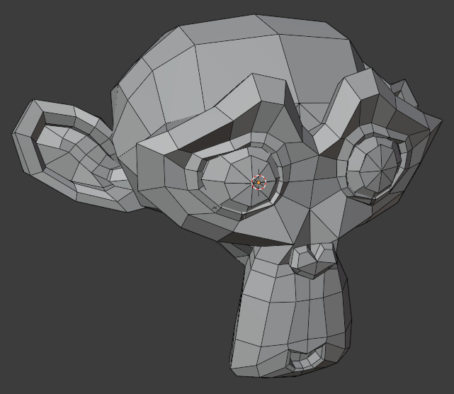

   Example of a polygonal mesh (Suzanne blender primitive)

Vertices, Edges, Faces, Polygons
================================
| **Vertex Mode >> Hotkey: 1**
| **Edge Mode >> Hotkey: 2**
| **Face Mode >> Hotkey: 3**

In blender we have the ability to change the **topology of a mesh** (how the mesh is constructed),
by modifiying its vertices, edges, faces (triangles) or polygons (quadrilaterials and ngons).
Once we are in **Edit Mode** we can switch between vertices, edges and faces by pressing
the number keys 1,2 and 3. The most common modelling tools we will use in this lesson
are described further below in the `Modeling Tools`_ section.

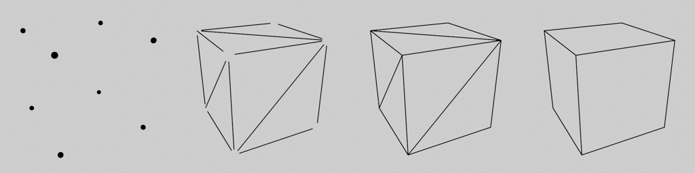

   vertices, edges, faces and polygons of a cube

Normals
=======
A normal is a vector that is perpendicular to a given object. In our case there are 
**face normals** and **vertex normals** that are perpendicular to the face or vertex
they originate from. On a 3D mesh **the direction of a normal determines how a polygon
or face is shaded and lit** and because **a face has a front and back, in which
direction the face is pointing**.

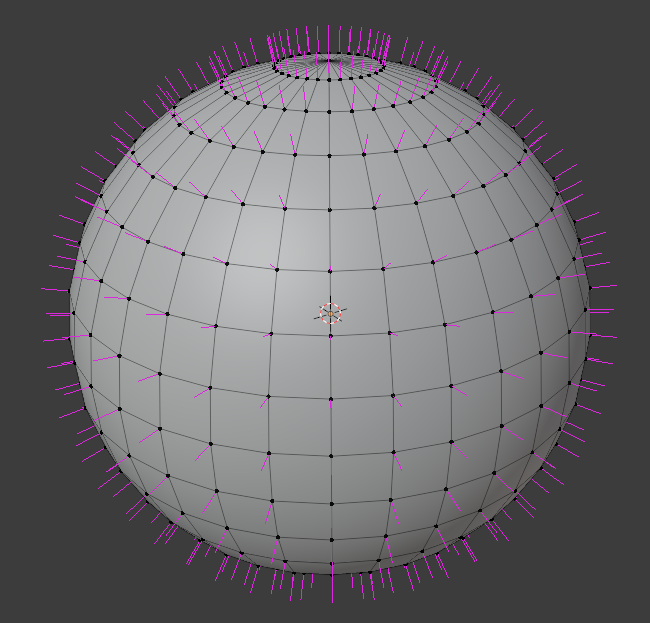

   3D Sphere with its smoothed normals displayed in pink 

.. tip::
    Faces with normals pointing in the wrong direction can be problematic in
    many cases, so it's important to check that our faces are "looking" in 
    the proper direction.
    Blender has a quick overlay view mode that colors a polygons frontface
    blue and its backface red, which is very useful for finding objects 
    where all faces are pointing inwards.

    **It can be enabled in the Viewport Overlays Menu in the top right of the 3D Viewport**

    To flip a faces orientation select it in **Edit Mode** and press **Hotkey: Alt + N** and
    select **Flip** to reverse its normal.

    .. image:: ../_static/images/bl_gui_3dview_faceorientation_example.png
       :width: 400

    .. image:: ../_static/images/bl_gui_3dview_faceorientation.png

How Normals affect Shading
--------------------------
As mentioned before the normal is used while shading and lighting a 3-dimensional
polygonal mesh. In its simplest form the shading is determined by calculating the
dot-product of the lightvector and the surfacenormal at the shading point. The 
dot-product of two vectors is 1 (Bright/Lit) if the vectors are parallel to each
other (the face is facing the light) and it is 0 (Dark/Shadowed) when the vectors
are perpendicular to each other.

Changing the vertex normals of a 3D plane will change how it is lit and shaded and
might lead to some very weird lighting, as shown in the figure below.

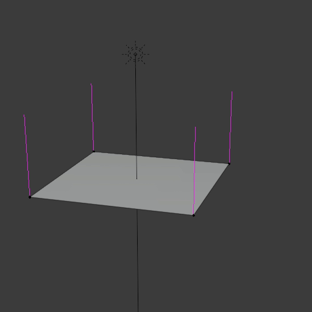

   3D Plane lit from above getting shaded differently as its normals (pink) are adjusted

Shade Smooth and Shade Flat
---------------------------
**Shade Smooth / Shade Flat >> Hotkey: RMouse in Object Mode**

We can also use the fact that normals affect the shading of a 3D mesh to our advantage.
By averaging the vertex normals of each face we can fake a smooth surface even though
the mesh consists of flat polygons (The silhouette of the mesh will not improve).
You can switch between **Flat Shading/Faceted Shading** and **Smooth Shading** by
**Right clicking in Object mode and selecting either from the context menu**.
This method is very prevalent in games and realtime graphics, which makes it possible
to have high fidelity graphics while keeping a lower polygon count.

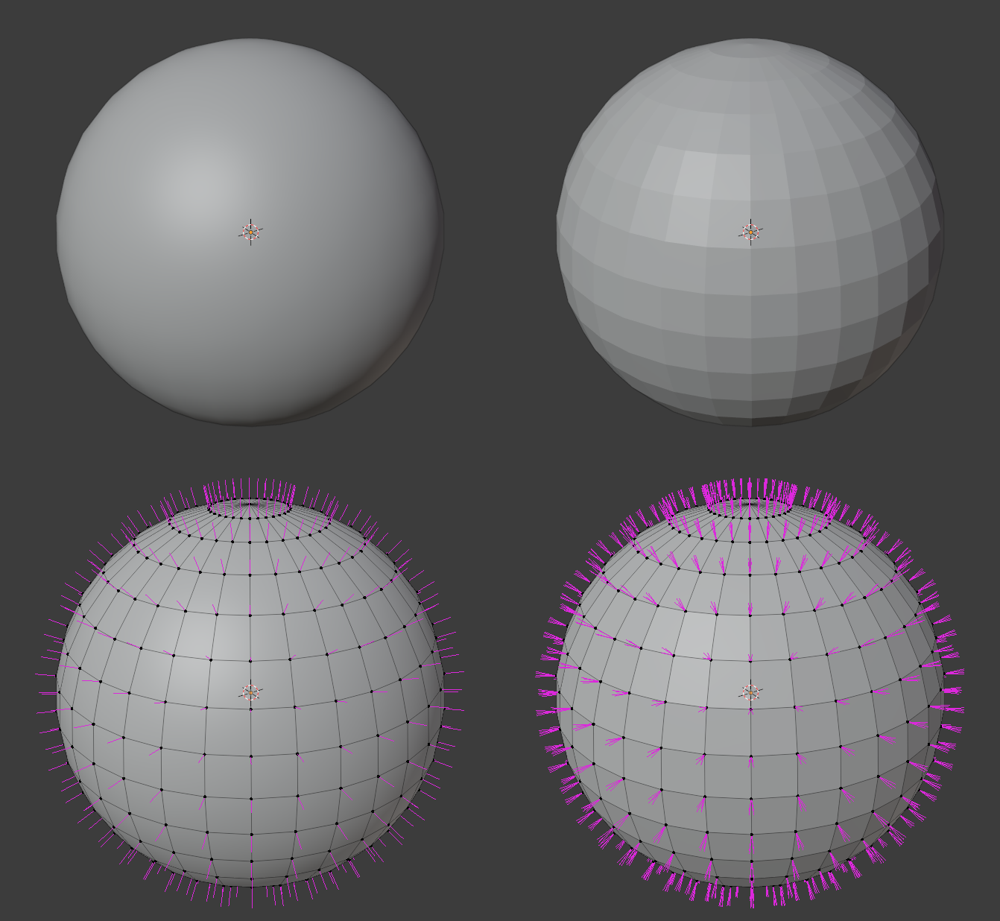
   
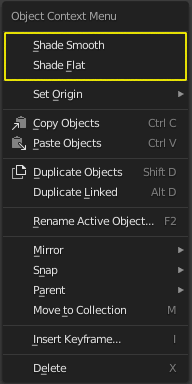

Auto Smooth
-----------
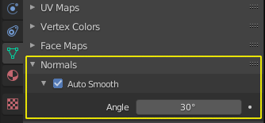

We can also change the normals of a mesh for each edge and define if the normals
should be split or averaged/smoothed between the surrounding faces but this is
only used when that degree of control is needed for the most part we can use
**Auto Smooth** which is an option that splits or averages the normals based
on the angle between the faces.

***************
Selection Tools
***************
Selecting vertices, edges and faces happens often while modeling so we should
try to be efficient and quick with it. As always there is more information
to be found in the official blender manual linked below this hotkey list.

=================== ===============================================
Hotkey              Action
=================== ===============================================
LMouse              Select vertex, edge, face
Shift + LMouse      Add or remove vertex, edge, face from selection
Ctrl + LMouse       Point to Point selection 
Alt + LMouse        Edge/Face Loop Selection
Ctrl + Alt + LMouse Edge/Face Ring Selection
A                   Select All
Alt + A             Deselect All
Ctrl + I            Invert current selection
Ctrl + Numpad+      Grow current selection outwards
Ctrl + Numpad-      Shrink current selection inwards
L                   Select connected Geometry
Alt + Z             X-Ray-Mode (lets you select occluded geometry)
=================== ===============================================

Blender Manual Link:
    `Blender Manual | Selection <https://docs.blender.org/manual/en/2.82/modeling/meshes/selecting.html>`_

**************
Modeling Tools
**************
**Switch between Edit and Object Mode | Hotkey: Tab**

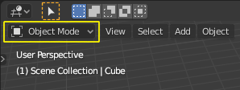

To access the modeling tools and be able to change the topology of the active objects
mesh data we have to switch from **Object Mode to Edit Mode** you can do that by
pressing **Hotkey: Tab** or by using the **object interaction mode dropdown** in
the top left corner of the **3D Viewport**. Now you can access all of blenders
mesh editing tools, some of which are described below. Once you are done editing
the mesh you can press **Hotkey: Tab** again to go back to **Object Mode**.

Loop Cut and Slide
==================
**Hotkey: Ctrl + R**

The Loop Cut tool is a great tool to add additional edges that follow the current topology.
It uses the concept of edge and face loops to determine where to cut and gives you the
ability to slide the new edge loop around before inserting it. More information on the
Loop Cut tool and what exactly face and edge loops are can be found by following the
links to the blender manual below.

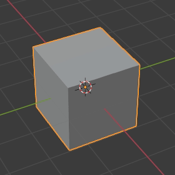

Blender Manual Link:
    `Blender Manual | Loop Cut <https://docs.blender.org/manual/en/latest/modeling/meshes/tools/loop.html>`_
    `Blender Manual | Select Loops <https://docs.blender.org/manual/en/latest/modeling/meshes/selecting/loops.html>`_

Knife/Cut
=========
**Hotkey: K**

The Knife tool is great for cutting arbitrary shapes into the existing geometry.
After you have set your cut by left clicking repeatedly confirm the cut by pressing Return/Enter.

Blender Manual Link:
    `Blender Manual | Knife <https://docs.blender.org/manual/en/latest/modeling/meshes/tools/knife.html>`_

    
Bevel
=====
**Hotkey: Ctrl + B**

The Edge Bevel Tool allows you to round of edges or chamfer them. It's one of
the best tools for smoothing out the very harsh and unnatural edges of our meshes.

Blender Manual Link:
    `Blender Manual | Bevel <https://docs.blender.org/manual/en/latest/modeling/meshes/editing/edge/bevel.html>`_

Extrude and Inset
=================
| **Extrude >> Hotkey: E**
| **Inset >> Hotkey: I**

Extruding is one of the main ways to add geometry and simultaneously grow our object/mesh
into a direction, it works on all mesh components (vertex, edge, face).

Inset is a great to to create slots or prepare geomtry for extrusion. It's also one
of the tools that will be very useful later on when we look at subdivision surface
modeling.

Blender Manual Link:
    * `Blender Manual | Extrude <https://docs.blender.org/manual/en/latest/modeling/meshes/tools/extrude_region.html>`_
    * `Blender Manual | Inset <https://docs.blender.org/manual/en/latest/modeling/meshes/editing/face/inset_faces.html>`_

Deleting and Welding/Merge
==========================
| **Deleting Geometry >> Hotkey: X**
| **Welding/Merging >> Hotkey: M**

We can also simply delete components of the mesh (vertex, edge, face) to create
holes or prepare the geomtry for other operations by pressing **Hotkey: X**

Sometimes we have holes in our meshes or wish to merge together vertices to create
spikes or other shapes. The Merge tools let you close meshes or weld together vertices
into a single vertex.

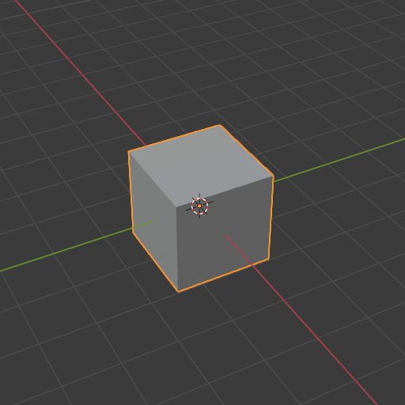

Blender Manual Link:
    `Blender Manual | Merge <https://docs.blender.org/manual/en/latest/modeling/meshes/editing/mesh/merge.html>`_

Closing holes in meshes
=======================
In addition to welding vertices we can also close holes in meshes in other
ways using other tools. Some of those tools don't have Hotkeys assigned to
them so you can access them via the **context dropdown menus in the top left
of the 3D Viewport**, alternatively you can use the **Operator search popup**
**(Hotkey: Spacebar)** to search for the operator without having to navigate the
menus.

Create Face
-----------
| **Create Face >> Hotkey: F**

Create face will construct a Polygon (Triangle, Quadrilateral or N-Sided Polygon [N-Gon])
from the selected vertices or edges. It is up to you to subdivide large N-Gons
in a smart way afterwards to prevent shading issues.

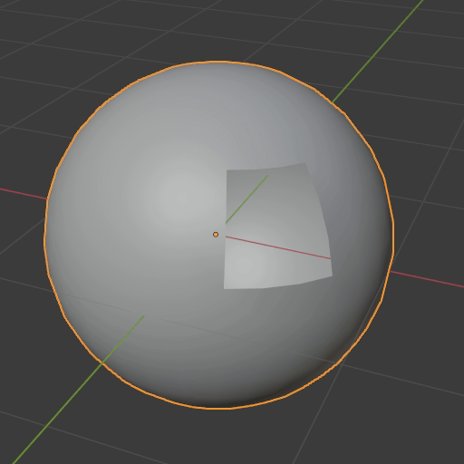

Blender Manual Link:
    `Blender Manual | New Face <https://docs.blender.org/manual/en/latest/modeling/meshes/editing/vertex/make_face_edge.html>`_

Grid Fill
---------
| **Grid Fill >> Face >> GridFill**

Grid fill will create a geometry patch consisting of multiple faces and will try
to shape the patch so it follows the form of the surrounding geometry.

Blender Manual Link:
    `Blender Manual | Grid Fill <https://docs.blender.org/manual/en/latest/modeling/meshes/editing/face/grid_fill.html>`_

Bridge
------
| **Bridge >> Edge >> Bridge Edge Loops**

Bridgeing can be used to close holes in meshes by selecting two groups of vertices or
edges. Alternatively you can punch holes into a mesh by selecting two groups of faces
and the Bridge tool will delete them and connect their borders. 

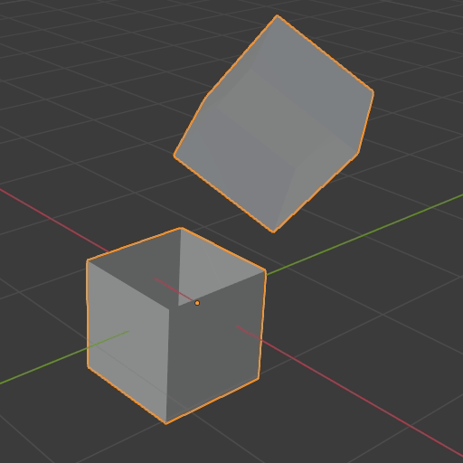

Blender Manual Link:
    `Blender Manual | Bridge <https://docs.blender.org/manual/en/latest/modeling/meshes/editing/edge/bridge_edge_loops.html>`_

************************
Principled BSDF Specular
************************
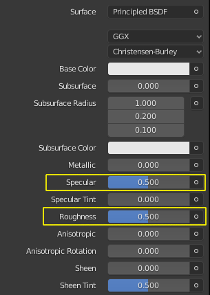

For this assignment you can experiment with the **Principled BSDF Materials**
**Roughness** and **Specular** parameters to change the surface look of your
material. **Roughness** affects the surface roughness, a value of 0 will make your
material very shiny/glossy while a value of 1 will make it very rough and dull.
**Specular** controls how much the surface reflects light overall, a value of 0
means the material will not reflect anything while a value of 1 will boost the
amount of lightreflection the material has. The **Default value of 0.5** for
the **Specular** parameter is physically correct for a large amount of Materials.

.. figure:: ../_static/images/bl_material_roughness.gif
   :figwidth: 300
   :align: left

   Material Roughness from 0 (glossy) to 1 (rough)

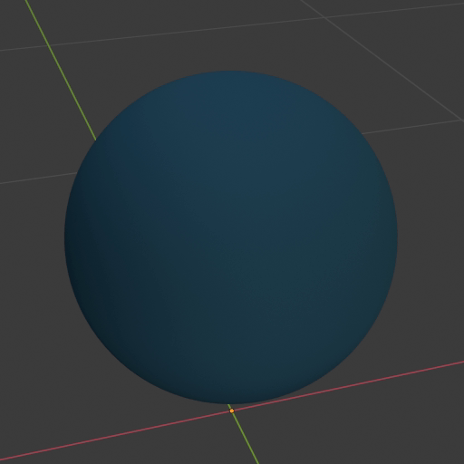

   Material Specular from 0 (no reflection) to 1 (very reflective)
