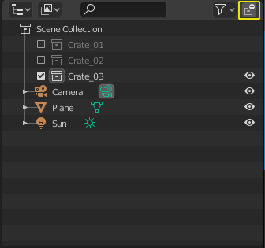
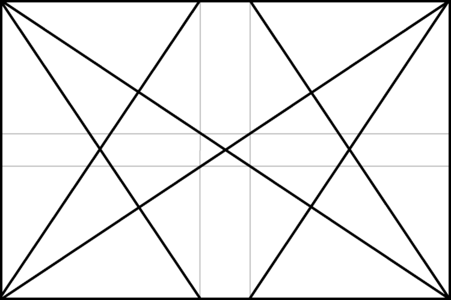

############################
Lesson 3 - Advanced Modeling
############################

In this lesson we are going to do some concept art, but we are not going 
to draw, we are going to model it and then render it to look like
concept art. The goal is to create 5 Scifi-Container designs using the
methods and techniques shown in this lesson and listed below. An example
of how the end result can look like just below this text.

**We will be looking at following topics:**

* 3D Topics
    * Basic Scene Management with collections
    * Non-destructive / Procedural Modelling techniques
    * Constructive Solid Geometry (CSG/Booleans)
    * Freestyle line rendering
* Design Theory
    * Big, Medium, Small
    * Gestalt Principles
    * Dynamic Symmetry and Rule of thirds

*********
3D Topics
*********

Collections / Groups
====================
We can use collections to organize our blender scene and group multiple objects
that belong together. You can navigate your scenes **Collections** in the 
**Outliner** at the top right in the Blender UI. To add objects to a collection
simply **Drag and Drop them onto the Collection in the Outliner**.

To make sure all newly created objects are automatically added to the collection
you want **click on the box icon next to the name of the collection to make it
the active collection** (In the image below the *Crate_03* Collection is active)

   Blender Outliner with the button to create a new collection highlighted in yellow

.. tip::
    You can also add objects to a collection by selecting them in the **Outliner**
    or **3D Viewport** and pressing **Hotkey:M** to open a floating context menu
    next to your mousecursor with a list of all collections in the file and click
    on the collection name.
   

Blender Manual Link:
    `Blender Manual | Collections <https://docs.blender.org/manual/en/latest/scene_layout/collections/collections.html>`_

Non-destructive / Procedural Modelling (Modifiers)
==================================================
.. figure:: ../_static/images/bl_gui_modifier_panel.png
   :align: right

   Modifier Panel for a cube object

While all the changes to the mesh we have been doing in edit mode are final
and are hard to change once we exit the modeling tool, there are other ways
to modify geometry that keep the operations adjustable. This way of modelling
is often referred to as **Procedural Modelling** or **Non-destructive Editing**
because we can change the parameters of the modeling operators at any time.

Blender uses **Modifiers** which can be added to objects to implement this
functionality. The |props_modifier| **Modifier Panel** in the **Properties
Panel** on the right hand side of Blenders UI lets you add modifiers to the
currently active object.

   List of all available modifiers in blender

**We will use the following modifiers in this lesson:**

* Mirror
* Boolean
* Solidify
* Bevel
* Subdivision Surface
  
.. warning::
    Some modifiers may behave very weird if you have been scaling your objects
    in object mode. That's because their settings sometimes depend on the object
    scale. To prevent unexpected results you should use the **Apply Scale** 
    command to reset the objects scale back to 1.0.

    | **Check object Scale >> 3D Viewport Sidebar (Hotkey: N) >> Item tab >> Scale**
    | **Apply Scale >> Hotkey: Ctrl + A**

    .. image:: ../_static/images/bl_gui_3dview_item.png
    .. image:: ../_static/images/bl_gui_apply_scale.png

Blender Manual Link:
    `Blender Manual | Modifiers <https://docs.blender.org/manual/en/latest/modeling/modifiers/index.html>`_

Constructive Solid Geometry
===========================
**Constructive Solid Geometry** or **CSG** for short, describes the process of creating
complex geometry from simple solid primitives by subtracting, adding or intersecting
their volumes.
Often this process is called **Booling** or **Boolean operation** because the process
of subtracting, adding or intersecting is often expressed as typical mathematical 
**boolean operations** (NOT, OR, AND, XOR, ...).

In Blender the **CSG/Boolean modifier** features the following boolean operations:

* Difference (Boolean NOT)
* Union (Boolean OR)
* Intersection (Boolean AND)

======================== ============================= ===============================
Boolean Union (**∪**)    Boolean Difference (**-**)    Boolean Intersection (**∩**)
======================== ============================= ===============================
|csg_union|              |csg_difference|              |csg_intersect|
Union of Cube and Sphere Difference of Cube and Sphere Intersection of Cube and Sphere
======================== ============================= ===============================

.. |csg_difference| image:: ../_static/images/bl_csg_difference.png
    :width: 300
    :alt: Show boolean difference between a 3D Sphere and Cube
.. |csg_intersect| image:: ../_static/images/bl_csg_intersection.png
    :width: 300
    :alt: Show boolean intersection between a 3D Sphere and Cube

With these simple boolean operations it is possible to construct very complicated
geometry while combining very simple building blocks. Multiple CSG operations can
be displayed as a binary tree like in the figure below. The resulting geometry
is shown at the top while it's operands and boolean operations are shown as leaves
(Cylinder, Cube, Sphere) and nodes (Union, Difference, Intersection).

.. figure:: ../_static/images/wikimedia_commons_zottie_csg_tree.png
    :alt: Image showing a binary tree of boolean operations with their operands as leaves
    :width: 600

    Example of complex geometry constructed from simple solid primitives
    (`Wikimeda Commons: Zottie <https://en.wikipedia.org/wiki/Constructive_solid_geometry#/media/File:Csg_tree.png>`_)

.. warning::
    Boolean operations work only on solid objects, meaning closed 3D Meshes without holes and their normals
    pointing in the right directions (inward). If a Boolean operation fails check your Operands for holes
    or unwelded vertices.

How it works in Blender
-----------------------
Boolean operations are implemented as a blender modifier. The modifier is simply called
**Boolean**.

Here is the step by step process to create a boolean operation between a cube and a sphere:

#. Create a cube (**Shift + A >> Mesh >> Cube**) [Operand A]
#. Create a sphere (**Shift + A >> Mesh >> Sphere**) [Operand B]
#. Select the cube, it will act as our stock (Operand A)
#. | Add a Boolean modifier in the **Modifier Properties** |props_modifier|
   | *The Modifier Properties are located at the right hand side in the* **Properties Panel**

   #. Add the boolean modifier to the cube (**Add Modifier >> Boolean**)
   #. Use the **Object:** Eyedropper tool in the modifier gui to select the sphere as a cutter

      |modifier_panel|
      |boolean_cutter|
#. Select the Sphere in the 3D Viewport and open the **Object Properties** |props_object|
#. Navigate to the **Viewport Display Rollout** and set the spheres display to **Bounds**

   |viewport_display|
#. Now you can manipulate your Sphere (Cutter/Operand B) by selecting its bounds
   and transforming it and the boolean operation will update accordingly.

The result should look something like this:

.. image:: ../_static/images/bl_boolean_cube_sphere.png
    :width: 300

.. |props_modifier| image:: ../_static/images/bl_gui_props_modifier.png
.. |props_object| image:: ../_static/images/bl_gui_props_object.png

.. |modifier_panel| image:: ../_static/images/bl_gui_modifier_panel.png
    :width: 100
.. |boolean_cutter| image:: ../_static/images/bl_modifier_boolean_operand_b.png
    :width: 100

.. |viewport_display| image:: ../_static/images/bl_gui_viewport_display_bounds.png
    :width: 100

.. warning::
    Your Cutter object will still be visible when you Render your final image (**Hotkey: F12**)
    to get control over which objects will show up in the final render you need to enable the
    **Disable in Render Flag** in the **Outliner Filter Menu** (Shown below).

    .. image:: ../_static/images/bl_gui_outliner_filter_renderflag.gif

A faster and more convenient way to work with booleans
------------------------------------------------------
There is an addon that ships with blender that makes all of this way easier.
Its called **Bool Tool** and you can find it in the **Preferences >> Add-Ons**.

.. image:: ../_static/images/bl_preferences_addons_booltool.png

After activating the addon you can call it's menu by pressing **Hotkey: Ctrl + Shift + B**

.. image:: ../_static/images/bl_gui_bool_tool.png

The process for booling a cube and a sphere is now way faster and easier:

#. Select the sphere (Operand B / The Cutter)
#. Select the cube (Operand A / The Stock)
#. Press **Ctrl + Shift + B**
#. Select the appropriate boolean operation from the menu

.. note::
    **Brush Boolean** keeps the boolean operation interactive and you can still move
    the cutter while **Auto Boolean** will apply the boolean and only leave the resulting
    mesh behind. Therefore only choose Auto Boolean if you are sure you don't want
    to tweak the result.

Material Slots and Boolean modifiers
------------------------------------
During the boolean operation with Operand A and Operand B some attributes that are
set on Operand B (Cutter) will be transferred over to the geometry the boolean operation
creates on Operand A. **That means the resulting faces will carry over the Material, Normals
and some other attributes of Operand B**. With this we can not only cut away or add to our
Designs but also **simultaneously assign materials to specific areas of the resulting mesh.**

**For this to work we have to make sure there are Material slots on our Stock / Operand A Object.**

To add a material slot you can press the **Button with the + symbol** in the |props_material|
**Material Properties Panel** (Highlighted in **Yellow** in the image below)

You can also **apply specific Materials to selected Faces** in **Edit Mode** by
selecting it in the **SlotList** (Highlighted in **Blue**) and then clicking on the **Assign-Button** 
(Highlighted in **Red**, only visible in **Edit Mode**).

.. figure:: ../_static/images/bl_gui_props_material_slots.png
    
   MaterialSlot-List (**Blue**), Add/Remove Materialslot button (**Yellow**) and Edit
   Mode Buttons (**Red**)

.. tip::
    For our Big, Medium, Small Color coding with White, Grey, Darkgrey to work we will
    have to setup our Material Slots exactly like in the image above on our Operand A
    (Stock Object). And then have a single material on our Operand B that matches it's
    Size (Big, Medium, Small) and it will carry over and be shaded correctly.

**Video showing how to assign materials to different faces in edit mode:**

.. raw:: html

    <video controls src="../_static/videos/bl_gui_props_material_slots_assign.mp4"></video>

Freestyle Line Renderer
=======================
Blenders Freestyle line renderer lets you create Non-Photorealistic-Renders (NPR).
It is very customizable and has a huge amount of parameters you can tweak to create
very unique looking lineart, that can look very close to a handdrawn style. We will
be using very basic settings to achieve the look in the image below, but feel free
to experiment.

To activate the **Freestyle Renderer** open the |props_render| **Render Properties Panel**
in the **Properties Panel** on the right hand side and scroll down to the **Freestyle Rollout**
and tick the checkbox.

All settings for the **Freestyle Renderer** are in the |props_viewlayer| **Viewlayer Properties**
in the **Properties Panel** at the very bottom of the Viewlayer Panel. I recommend bumping the
**Crease Angle** setting up to **160 Degrees** so even very shallow changes in geometry are getting
drawn as outlines.

To Match the look of my example you can adjust your settings until they reflect those in the screenshots below.

.. hint::
    If the line width modulation doesn't look right in your scene it might be because
    you are working at a different scale than me. You can adjust the width modulation
    by changing the **Period of the Noise Modifiers** to bigger or smaller values.
    Smaller values will make the changes in line width more abrupt will larger values
    will make the changes more subtle and smooth.

    The first and second noise modifier are using periods in a ratio of 3 to 1 (150 to 50).
    If you want to keep the look adjust them but keep the ration the same (i.e 60 to 20 or 300 to 100)

    If the width modulation isn't strong enough you can play with the **Influence Sliders**.

*************
Design Theory
*************

Big, Medium, Small (Primary, Secondary, Tertiary)
=================================================
**Big, Medium, Small** or **Primary, Secondary, Tertiary Shapes** or **1st, 2nd, 3rd Read**
are all names for the way we can **structure our designs to make it easier to understand,
more pleasing to the eye and more interesting**. It's what makes a design interesting, cool
or satisfying to look at, if it is applied correctly and in conjunction with the other
principles explained below.

Ratio at which the Elements should occur
----------------------------------------
This design theory also dictates at which ratio the Big, Medium and
Small Elements should appear in relation to each other.

This ratio can vary a little bit but most of the time it is **70/30** or **80/20**.
For example the **Big shape takes up 70% of the design while the medium sized shape
takes up 30%**. Continuing with this the Small Shapes take up 30% of the space
the Medium Shapes leaving 70% uncluttered.

Variation and Clustering
------------------------
Too much of the same shape is boring, so try to have variation in the size of
the shapes in all three categories (Big, Medium, Small). When you place a lot
of small shapes, instead of positioning them evenly spaced try to cluster them
together in groups while leaving some larger spaces between them for a more pleasing
design.

Example of color coded designs (Big, Medium, Small | White, Grey, Black | Blue, Yellow, Red)

Further Reading/Watching:
    * https://www.youtube.com/watch?v=ZluGXgpdJj4
    * https://www.linodriegheart.com/design-principles-in-concept-art-and-design/
    * http://neilblevins.com/cg_education/primary_secondary_and_tertiary_shapes/primary_secondary_and_tertiary_shapes.htm
    * https://www.youtube.com/watch?v=6IojuePYIHo
    * https://www.youtube.com/watch?v=qMH_J_vcoqE

Gestalt Principles/Psychology
=============================
The **Gestalt Principles/Psychology** is a school of psychology that first emerged in Germany and Austria in the early 1900s.
It was opposed to the dominant view of structuralism that ruled the field of psychology in that time. With the help of
test and experiments the psychologists came up with a set of rules for perception which are listed below.

Instead of long explanations I tried to keep the rules to one liners with one or two example images.
If you want to read more on the subject there are links for further reading at the bottom of this section.

Figure-Ground Relationship
--------------------------
How we perceive an object is determined by the relationship of the object or figure to its background.
Good Figure-Ground Relationship most of the time means good readability of shapes/objects/characters.

.. image:: ../_static/images/design_gp_fgr.png
   :width: 300
.. image:: ../_static/images/design_gp_fgr_rubin_vase.jpg
   :width: 300

Law of Closure
--------------
We favor closing incomplete shapes instead of seeing their parts as their own shapes.

Law of Continuity
-----------------
Lines or Curves that aren't complete will be automatically completed in our brains.
An X shape will be interpreted as two crossing lines not two bent/kinked lines.

Law of Praegnanz / Simplicity
-----------------------------
We perceive shapes always in their simplest form (primitives).

Law of Proximity
----------------
Elements who are close together will be perceived as belonging together.

Law of Similarity
-----------------
Elements who are similar to each other will more likely be perceived as as belonging together.

Law of Symmetry
---------------
We perceive objects as being symmetrical and forming around a center point. It is pleasing to the
eye to divide objects into symmetrical parts, we also perceive unconnected objects as symmetrical
to a point or axis if possible.

Further Reading:
    * https://www.canva.com/learn/gestalt-theory/
    * https://www.interaction-design.org/literature/topics/gestalt-principles
    * https://www.creativebloq.com/graphic-design/gestalt-theory-10134960
    * https://www.andyrutledge.com/gestalt-principles-1-figure-ground-relationship.html

Dynamic Symmetry and Rule of Thirds
===================================
These two theories are used to help you compose a shot/painting/scene. They come
with rules or grids that you can use to align objects inside your cameraview to 
get a more pleasing composition.

The Rule of thirds can be a stepping stone and an okay helper in the beginning but
truly great composition uses a lot more rules/guides. Dynamic symmetry steps in here
with a more complex grid that helps create more pleasing images because its grid follows
other very important rules.

Rule of Thirds
--------------
John Thomas Smith (1766-1833) [English painter, engraver and antiquarian] came up with
the rule of thirds in 1797. By splitting the Image into thirds with four lines a simple
grid is created. It is claimed that positioning your subject on one of the *power points*
(the intersections of the gridlines) or close to it will create more interest and a better
composition than shooting your subject dead center. 

You can get good artwork with the rule of thirds if you use additional other 
principles, but if you only focus on the rule of thirds you are limiting yourself
and your art.

.. warning::
    The rule of thirds is not in this list because it is a good tool or something
    I want you to use. It's here as a bad example, as an example of how oversimplifying
    something complex like composition can lead to bland artwork. It's better than 
    nothing, thats for sure, but it's a dead end composition wise, it will not lead
    you anywhere after your first improvements.

**Example: John Thomas Smith**

Further Reading:
    * https://en.wikipedia.org/wiki/Rule_of_thirds
    * https://photographylife.com/the-rule-of-thirds

Dynamic Symmetry
----------------
Dynamic Symmetry was formulated by Jay Hambidge (1867-1924) and is a system
defining compositional rules inspired by Greek architecture, sculpture and ceramics.

It's most useful part is the dynamic symmetry grid which can be used to arrange objects
in our scene/frame.

   
   Dynamic symmetry grid for a 1.5 Rectangle (typical film camera sensor aspect ratio)

The dynamic symmetry grid has the following parts:
    * Baroque diagonal (lower left to upper right)
    * Sinister diagonal (lower right to upper left)
    * The Reciprocals (crossing the sinister and baroque at 90 degree angles)
    * The Eyes (points where lines are crossing)

In a process called Major Area Division (MAD) we can use multiple shrinked down
dynamic symmetry grids to get even more lines to align our subjects to. Major
Area Subdivision is shown below in the third image.

**Example: William-Adolphe Bouguereau - Pieta (1876)**

**Example: William-Adolphe Bouguereau - Dante and Virgil in Hell (1850)**

Further Reading:
    * http://larmonu.larmonstudios.com/dynamic-symmetry/
    * https://photographycourse.net/dynamic-symmetry/

Grids in Blender
----------------
You can enable the rule of thirds grid and the dynamic symmetry grid in Blender
by selecting your Camera and navigating to the |props_object_data| **Object Data
Panel** in the **Properties Panel** on the right hand side of Blenders UI.
Open the **Viewport Display Rollout** and then expand the **Composition Guides
Subrollout** to find a series of checkboxes that will give you access to different
grids. Once checked the grid will be drawn in the 3D Viewport if you are looking through
the camera.

