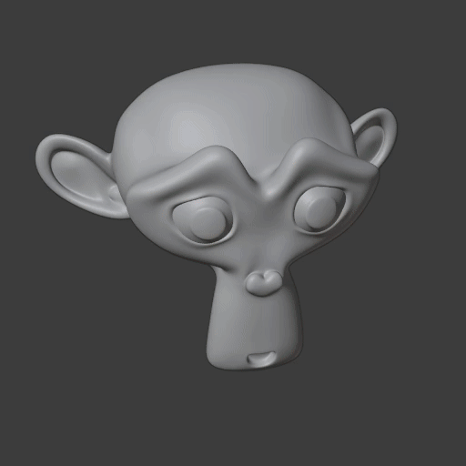

############################
Lesson 4 - Freeform Modeling
############################
In this lesson we will be mainly talking about **Subdivision Surface Modelling**.
But the Assignment 4 will not use the techniques discusses below. Instead we will
use everything we learned up to lesson 3 to flesh out a concept of a Robot. That
we will later make production ready with the techniques below.

.. image:: ../_static/images/robot_concept.png
   :width: 600

*****************************
Subdivision Surface Modelling
*****************************
To get smooth looking surfaces instead of the faceted or blocky representations
of objects we have been creating until now we can leverage the **Subdivision
Surface Modifier**. The subdivision surface algorithm will create additional
geometry for us, while we only have to edit a simple mesh (often called control cage).

Algorithm - What is happening under the hood
============================================
The subdivision surface algorithm is a recursive algorithm that refines our input
mesh by subdividing it and creating new vertices, edges and faces. Every
implementation of the subdivision surface algorithm has an **Iterations Parameter**
which will enable us to set the number of recursions and create smoother and smoother
looking meshes by subdividing it more and more.

During the refinement stage the shape of our object can change very drastically, we
will discuss ways to control the shape in the section below.

.. figure:: ../_static/images/bl_modifier_subdivisionsurface_cube.gif

    Cube Mesh getting subdivided from 0 to 5 Iterations.

.. warning::
    A big limitation of the Subdivision surface modelling approach is that the algorithm
    only works predictably well on **quadrilaterial faces I.e faces with 4 vertices**.
    Using **triangles or N-gons** will result in **artifacts, bumps and pinches in the
    smoothed surface** and can also lead to the mesh totally losing its form in some places.

Topology for subdivision surfaces
=================================
During the subdivision/refinement the shape of our object can change quite drastically.
How much it changes and which features of the input shape are being smoothed and which
aren't depends on how the mesh is constructed. The structure of a Mesh, I.e how it's
vertices, edges and faces are laid out is often called its **Topology**.

A mesh/control cage that works will with the subdivision surface algorithm has 
good **topology/edgeflow**, I.e the way in which its **edgeloops** and **edgerings** are
laid out create no problems for the subdivsion surface algorithm.

.. figure:: ../_static/images/bl_3dview_subd_topo_example.png
   :figwidth: 600

   Subdivions surface mesh with its control cage edges shown in a smoothed
   **Optimal Display** mode.

Supporting/Holding Edges (Rule of Three)
----------------------------------------
How much the geometry is being smoothed and pulled away from its control cage
depends on how far apart the edges of the control cage are. The farther apart
they are the more smoothing happens and the closer they are the more the 
shape of the control cage stays the same.

For optimal control of each edge in your control cage you want a **supporting
or holding edge** on each side of it. **With this set of 3 edges you can control
how the mesh is getting smoothed on each of the two sides of the edge defining
your base form.** This is sometimes called the **Rule of Three**.

Rule of Three:
    **Have a supporting/holding edge on either side of your form/shape defining edge**

.. figure:: ../_static/images/bl_subd_support_edges.gif

    Simple geometry showing how edge distance changes how the subd-algorithm
    smoothes the mesh.

Working with a support edge on either side of your base or formgiving edge has
other benefits as well. Which we will discuss in the section on `Collapsing/Terminating Edges`_.

Border Edgeloops
----------------
To be able to place supporting or holding edges close to our formgiving/shaping edges we
need to construct our **Edgeloops** and **Edgerings** in a specific manner.
One of those are the socalled **Borderloops**. Borderloops form a loop of connecting
edges that **follow the form of a specific feature we want to cut into our mesh or the
border/outline of our shape**.

.. figure:: ../_static/images/bl_subd_borderloops.png
   
   **Left to right:** Subdivided Mesh, its smoothed (optimal display) and unsmoothed control cage
   with borderloops highlighted in different colors. Every form giving edge als has supporting edges.

Collapsing/Terminating Edges
----------------------------
There will be areas in our mesh where we need more or less edges, so we will
have to get rid of or add in some edges. Because we want our mesh to consist
mostly of quadrilaterials (**Quads**) to prevent problems with the subdivision
surface algorithm we can't just simply remove or add them where/how we want to.

This problem is very common and we have already worked out solutions for most
cases. The graphic below shows the most common termination of edges, but there
will be situations where you will have to improvise and fix your edgeflow
yourself, without any help. The more you model with subdivision surfaces the
better you will get at it.

.. figure:: ../_static/images/bl_subd_quad_termination.png

   3 ways of terminating edges, while keeping everything in quads.

Additional Tools for Subdivions Surface Modelling
=================================================

Spotting problems and Artifacts
-------------------------------
When we want to create very smooth surfaces we need to be able to spot problem
areas where there are bumps, pinching or dimples in our surface. These things
are very hard to spot on a dull surface or with the default material that is
on our mesh when we model in the **Solid View Mode**.

Luckily we can apply a range of "materials" very quickly to all our objects
in the **3D Viewport** by using **Matcaps**. Very shiny matcaps make it easy
to find problematic areas on our subdivision surface models.

You can enable **Matcaps** on the top right hand side of the **3D Viewport**

#. Click on the **Downward triangle arrow** to the right of the **Viewport 
   Shading mode buttons**.
#. Click on the **Matcap button**
#. Change the current **Matcap** by clicking on the **Sphere below the Matcap 
   button** to open **a list of matcaps to selected from.**

.. tip::
    Sadly some very useful matcaps were dropped from the list of available matcaps
    with the release of Blender 2.8. I provide imagefiles of the in my opinion
    most useful matcaps for subdivision surface modelling.

    Download (right-click and choose Save image as...)
        .. image:: ../_static/images/mc12.jpg
           :width: 200
        .. image:: ../_static/images/mc15.jpg
           :width: 200
        .. image:: ../_static/images/mc16.jpg
           :width: 200
        .. image:: ../_static/images/mc17.jpg
           :width: 200

    After you **downloaded the images** you can add them to your matcaplist by:

    #. Opening Preferences with **Edit > Preferences...** or **Hotkey: F4 > Preferences...**
    #. Navigate to the **Lights** section by clicking on the button on the left.
    #. Clicking on the **Install** button in the **Matcap Rollout section**
    #. Using the **Filebrowser** to select all **Matcaps** you want to add and confirming
       with the button on the bottom right.

    .. figure:: ../_static/images/bl_preferences_lights_matcaps.png
    
        Blender Preferences Lights section showing my favorite matcaps already imported
        in the MatCaps Rollout.

Remove/Dissolve Edge
--------------------
**Hotkey: Ctrl + X**

The **Dissolve Selection Command** lets you remove edges and their corresponding
vertices quickly. This operation is very useful if you want to change the topology
of your mesh by rerouting some edges.

Connect Vertex Path
-------------------
**Hotkey: J**

This tool lets you create a cut between 2 selected vertices. It will use the
shortest path between them to make the cut. This tool is excellent for quick
short cuts for rerouting edgeflow in a mesh.

.. image:: ../_static/images/bl_edit_connect_vert.gif

Shrink/Fatten
-------------
**Hotkey: Alt + S**

Shrink/Fatten moves the selected vertices along their vertex normals and is
a great addition to the normal scale tool. In cases where scaling or moving
of multiple vertices doesn't do the job the **Shrink/Fatten Operator** often
helps a great deal.

LoopTools
---------
**Hotkey: RMouse-click (Edit Mode) [After you activated the Addon]**

The LoopTools addon has a range of useful tools that help us to create
shapes in our mesh or help us align a selection of vertices quickly.
Its most useful tool is the **Circle Command** which transforms the elements
of the current selection into a circle.

.. image:: ../_static/images/bl_edit_looptools_circle.gif

You can activate the addon like this:

#. **Edit >> Preferences...** or **Hotkey: F4 >> Preferences...**
#. Open the **Addons** tab on the left hand side
#. Use the **Search textinput** on the top right with the query **loop** to find the addon
#. Activate it by ticking its checkbox

.. image:: ../_static/images/bl_preferences_addons_looptools.png

*********
Materials
*********

PBR Model (Physically Based Rendering)
===============================================
The PBR model was created to better simulate real life materials and make it
easier for the artist to create physically accurate representations of surfaces.
It was adopted around 2013 and is very widespread and used in almost any 3D 
software and game engine out on the market currently. It replaced the old
**Specular/Glossiness Model** that we will briefly look at later.

Even though its name doesn't suggest it, you can also create materials and looks with
it that arent physically correct. The material model can also be used for heavily
stylized or cartoony looks.

The Blender **Principled BSDF** is a Shader that implements **Pixar's Principled Shader**
and builds on the **PBR Model**. 

The PBR Model in its most basic form includes the following parameters/slots:
    * Albedo/Basecolor
    * Specular
    * Roughness
    * Metallness/Metallic

Albedo/Basecolor
----------------
Albedo is the basecolor of you Material, it defines the color of the object 
when it is hit with very diffused light. If a map/texture is used it shouldn't
contain any lighting information (No Shadows or Highlights).

Good values for **Albedo/Basecolor** are in a specific range, it is recommended
to stay away from very dark values (< 0.05-0.1) and very bright values (> 0.8).
It is also good practise to not use overly saturated colors, very bright saturated
colors are not that common in the real world.

Specular
--------
The Specular parameter control how much a surface reflects light. The principled
BSDF has a default value of 0.5 which is accurate for a wide variety of materials.
An example for a material with low specular would be rubber while water, glass or
diamonds have a very high specular value.

Roughness
---------
This parameter or map defines how rough a surface is and how the specular reflection
behaves. A low roughness value yields a very smooth surface with mirror like reflection
while high roughness value simulate a rough surface with a very diffused specular reflection.

Metallness/Metallic
-------------------
Metallness or the Metallic value are used to switch the PBR Material model between
it's two modes. While this value is at 0 the Material simulates a dielectric
(non-conducting) surface (e.g Wood, Plastic, Glass, Rubber) with a white highlight.
When the parameter is turned up to 1 it simulates a metallic conductive surface
(Iron, Copper, Gold, Titanium) with a colored highlight. The color of the highlight
is derived from the **Albedo/Basecolor** value.

Specular/Glossiness Model
=========================
Even though the Specular/Glossiness Model got replaced you can still find 
Shaders and Materials in Render-Engines and other 3D software today that
kept it for backwards compatibility.

The Specular/Glossiness Model includes the following parameters/slots:
    * Diffuse
    * Specular
    * Glossiness
    * Index of Refraction (IOR)

Diffuse
-------
The Diffuse follows same concept as the **Albedo/Basecolor** in the PBR model,
but since the lighting calculation wasn't that well developed in games at the
time it often used textures/maps with lighting information (I.e Shadows and 
Highlights) in them.

Specular
--------
Specular is almost exactly the same as in the PBR Model, most Shader/Materials
have a value range of 0 to 1 (non reflective to very reflective). In the 
Specular/Glossiness Model this value is also used in combination with the
`Index of Refraction(IOR)`_ is used to create metallic looking surfaces.

Glossiness
----------
This Slot/Parameter defines how glossy (I.e smooth) the simulated surface is.
It is essentially the inverse of the **Roughness Parameter/Map** in the PBR 
Model. If you need to use an old **Spec/Gloss Model dataset** in a **PBR Model**
simply **invert the Glossiness to get the Roughness value**. 

Index of Refraction(IOR)
------------------------
The Index of Refraction is a physical term describing how much a ray of light
is bent when it enters a surface (Glass, Water). In most old shader models
this is linked to the Reflection stength (Index of Reflection). There are
`Tables with refractive indices available online <https://en.wikipedia.org/wiki/List_of_refractive_indices>`_.
To simulate metallic surfaces you could either turn the IOR up very high (values of 40+) or
drop it below a value of 1.

Shader Graph
============
In almost all 3D applications the construction of Materials/Shaders is done with
a network of nodes. This Node Graph allows the creation of highly complex networks
to simulate real surfaces very accurately.

In Blender you can access the Shader Graph by clicking on the **Shading Workspace**
at the top center of Blenders UI.

Blender Manual Links:
    * `Blender Manual | Shader Editor <https://docs.blender.org/manual/en/latest/editors/shader_editor.html>`_
    * `Blender Manual | Shader Nodes <https://docs.blender.org/manual/en/latest/render/shader_nodes/index.html>`_
