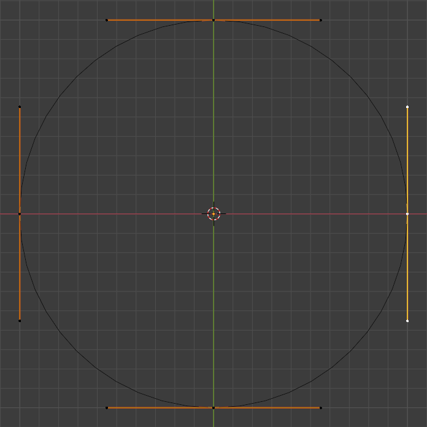
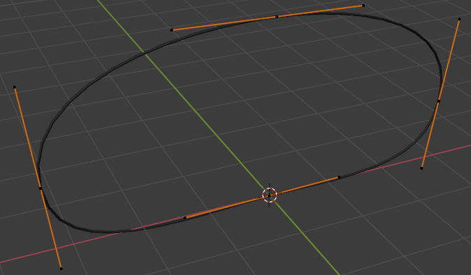
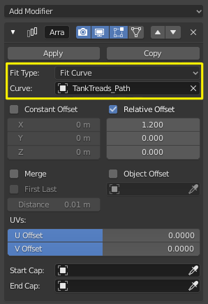
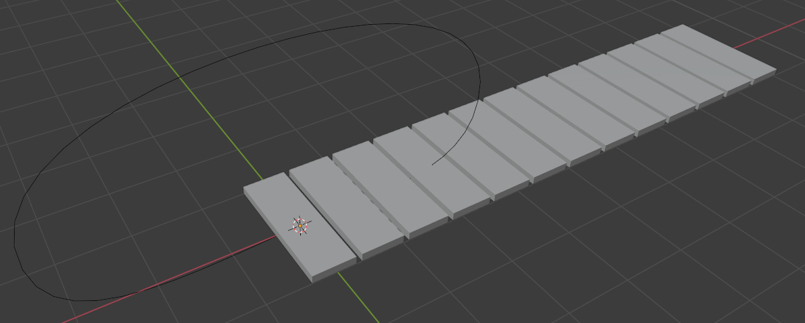
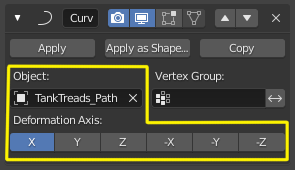
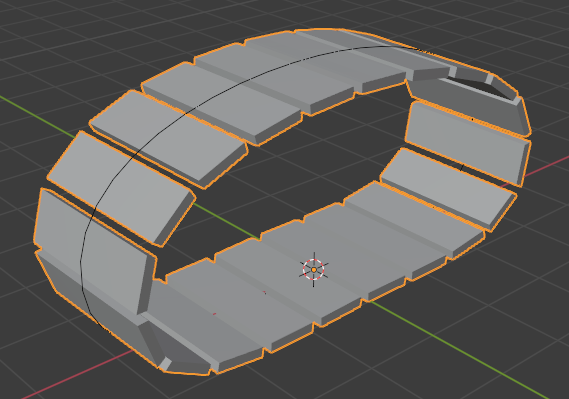
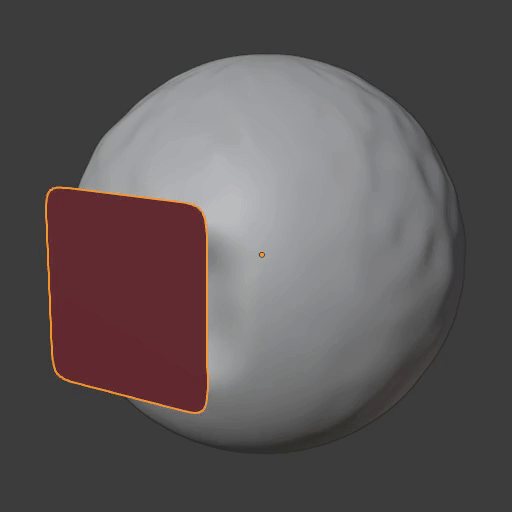
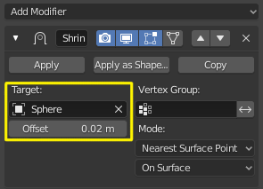

################
Lesson 5 - Recap
################

In this section we will look back at all the tools we have discussed so far.
It will feature cheatsheets with the most used commands for each area.

We will also look at the Curve Object type and at the end of the section
you can find two little "tutorials" on how to make tank treads and how
to shrinkwrap geometry onto other objects.

.. contents:: Table of Contents
    :depth: 3

******
Camera
******

===================== ==============================================================================
Hotkey                Function
===================== ==============================================================================
/                     Isolate the currently selected Object/s (pressing again returns to normal mode
Numpad 0              Look through the **Scene Camera** (pressing it again returns to viewport)
Ctrl + Numpad 0       Sets the current object as **Scene Camera**
Ctrl + Alt + Numpad 0 Aligns the selected camera to the viewport
===================== ==============================================================================

********
Modeling
********

Selection
=========

=================== ===============================================
Hotkey              Action
=================== ===============================================
LMouse              Select vertex, edge, face
Shift + LMouse      Add or remove vertex, edge, face from selection
Ctrl + LMouse       Point to Point selection 
Alt + LMouse        Edge/Face Loop Selection
Ctrl + Alt + LMouse Edge/Face Ring Selection
A                   Select All
Alt + A             Deselect All
Ctrl + I            Invert current selection
Ctrl + Numpad+      Grow current selection outwards (Select More)
Ctrl + Numpad-      Shrink current selection inwards (Select Less)
L                   Select connected Geometry
Alt + Z             X-Ray-Mode (lets you select occluded geometry)
=================== ===============================================

Modeling Tools
==============

=================== ================================================================
Hotkey              Action
=================== ================================================================
Ctrl + R            Loop Cut and Slide Tool
K                   Knife/Cut Tool
E                   Extrude Tool
Alt + E             Extrude Menu
I                   Inset Tool
Ctrl + B            Bevel Tool
X                   Delete Element Menu
Ctrl + X            Dissolve Element Tool
M                   Merge/Weld Menu
F                   Create Face Tool
J                   Connect Vertex Path Tool
Alt + S             Shrink/Fatten Tool
Alt + N             Normals Menu (Flip, Recalculate Inside/Outside, etc)
P                   Spearate Geometry Menu (Separate selected faces into new object)
=================== ================================================================

Object Tools
============

=================== =========================================================================
Hotkey              Action
=================== =========================================================================
Ctrl + J            Join Objects Tool (Join selected objects to active object)
Ctrl + A            Apply Menu (Apply Scale, Rotation, Location, etc)
Ctrl + L            Make Links Menu (Apply modifiers, material, etc from active to selection)
Shift + L           Select Linked Menu (Select Instances, Objects with same Material, etc)
=================== =========================================================================

BoolTool Hotkeys
================

====================== =========================================================================
Hotkey                 Action
====================== =========================================================================
Ctrl + Shift + B       BoolTool Context Menu
Shift + Ctrl + Numpad- Destructive/Auto Boolean Difference
Shift + Ctrl + Numpad+ Destructive/Auto Boolean Union
Shift + Ctrl + Numpad* Destructive/Auto Boolean Intersect
Shift + Ctrl + Numpad/ Destructive/Auto Boolean Slice
Ctrl + Numpad-         Procedural/Brush Boolean Difference
Ctrl + Numpad+         Procedural/Brush Boolean Union
Ctrl + Numpad*         Procedural/Brush Boolean Intersect
Ctrl + Numpad/         Procedural/Brush Boolean Slice
====================== =========================================================================

******
Curves
******
**Hotkey: Shift + A >> Curve**

Curves are a different type of base object in blender. They are an implementation
of a Bezier Curve in 3D-Space.

**A Bezier curve consists of the following subobjects:**

* **The Vector path itself**
* **Control Points the path has pass through**
* **Handles that control how the path passes through the control points** (Handles are always tangential to the curve path)

Tools you can use on the Curve object in Edit Mode:

====================== ========================== ======================================================================================
Hotkey                 Selection                  Action
====================== ========================== ======================================================================================
G                      Control Point/Handle       Move Control Point/Handle
R                      Control Point              Rotate Control Point and its Handles
S                      Control Point              Scale the Control Points Handles
Alt + C                Doesn't matter             Close/Open the Curve by connecting/separating its first and last point (Toggle Cyclic)
E                      Control Point              Add/Extrude another Point
RMouse >> Subdivide    2 adjacent Control Points  Adds a Control Point in between the two seleted ones
V                      Control Point/Handle       Lets you toggle the Control Point/Handle type
====================== ========================== ======================================================================================

*************
Workflow tips
*************

How to make tank treads
=======================
To make tank treads for our robot concept we need a guide path that our treads
can follow along. For this we will use a Curve Object.

Use the **Circle Curve Primitive** as a starting point for you tank treads and
adjust its shape with the tools mentioned above until you are happy with it.

Array Modifier
--------------
The Array modifier will copy our mesh at fixed distance along a chosen axis.
We will use it to create copies of our single piece of tanktread.

* **Add an Array modifier** to your single tank tread object
* **Set its fit Type to Fit Curve** and pick your **Tank Tread Guide Curve** 
  in the **Curve Slot**

  The Array modifier will automatically create enough copies of your single
  tank tread to fit the entire length of the **Tank Tread Guide Curve**.
* Use the **X, Y, Z Values** in the **Relative Offset/Constant Offset Section**
  to change the width of the gaps between your tank treads.

Blender Manual Link:
    * `Blender Manual | Array Modifier <https://docs.blender.org/manual/en/latest/modeling/modifiers/generate/array.html>`_

Curve Modifier
--------------
We will use the curve modifier to deform our arrayed geometry. The modifier will
take care of wrapping our treads around the supplied curve.

To do this: 

* apply the curve modifier to your arrayed tank tread and and pick
  your **TankTreads_Path Curve** in the **Object Slot**.
* Choose the right **Axis** with the buttons in the **Deformation Axis Area**

Blender Manual Link:
    * `Blender Manual | Curve Modifier <https://docs.blender.org/manual/en/latest/modeling/modifiers/deform/curve.html>`_

Shrinkwrap modifier | How to wrap geometry onto other geometry
==============================================================
The Shrinkwrap modifier is a rather simple but nonetheless very powerful modifier.
It can project and deform geometry onto other geometry and make it follow the targets
surface.

**How to use:**

* Add the **Shrinkwrap modifier** to the **object you want to conform to another geometry**
* Add the **GuideMesh/Object you want your geometry shrinkwrapped to** in the **Target Slot**
* Adjust the **Offset** parameter to push the object off the **GuideMesh's surface**

Blender Manual Link:
    * `Blender Manual | Shrinkwrap Modifier <https://docs.blender.org/manual/en/latest/modeling/modifiers/deform/shrinkwrap.html>`_
