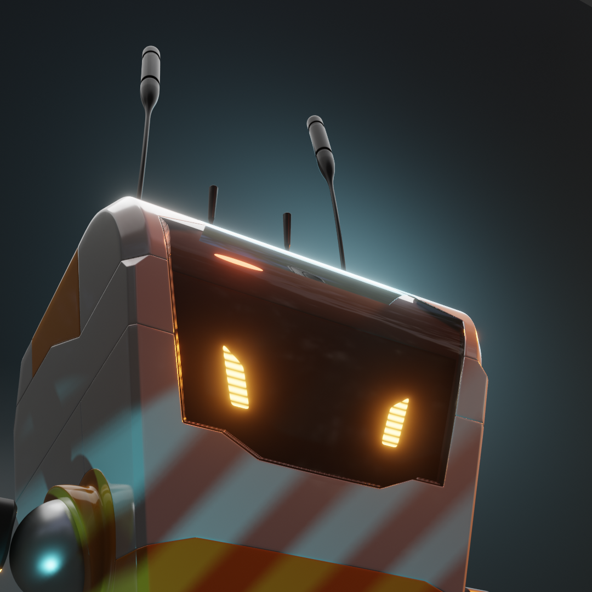

############################
Lesson 6 - Materials and UVW
############################

*********
UVW-Space
*********

What are UVW's
==============

0 to 1 UVW Space
----------------

UVW Islands or Shells
---------------------

The UV Editing Workspace
========================

**************
Material Nodes
**************

Adding Nodes
============

ImageTexture
============

Colorspace
----------

Texture Coordinate
==================

Mapping
=======

MixRGB
======

NormalMap
=========

Noise Texture
=============

Wave Texture
============
