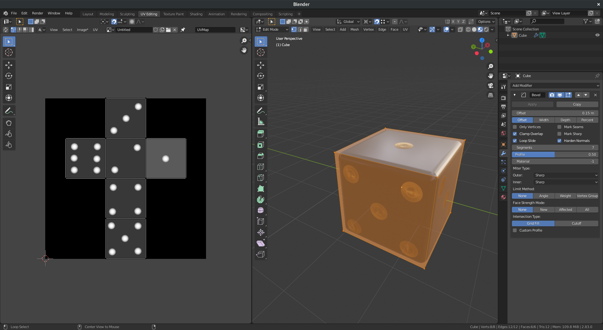

############################
Lesson 6 - Materials and UVW
############################

*********
UVW-Space
*********
In addition to our XYZ-Coordinate 3D Space there is a second UVW-Coordinate Texture Space
in which the U and V Coordinate represent the width (X) and height (Y) and the W Coordinate
represents the depth (Z). Most of the time we will use only the UV-Coordinate pair to create
a mapping between the 2-Dimensional UV-Coordinates and the XY-TangentSpace-Coordinate of our mesh.

What are UVW's
==============
In most cases a UVW-Mapping or UVW-Unwrapping is a 2-Dimensional flat representation of our
3-Dimensional mesh, and uses only the U and V Coordinate. That's why its often only called 
UV-Unwrapping or UV-Mapping. Each Vertex in the 2-Dimensional UV space maps to a 
3-Dimensional vertex on our mesh. This enables us to map/paint 2D Textures/Images onto
our 3D meshes and control how exactly they look no our 3D Faces.

    2D-UV Map showing dice dot texture side by side with 3D View showing the
    texture mapped to the 3D mesh.

0 to 1 UVW Space
----------------
The UVW Space is often displayed as a 2-dimensional cartesian coordinate system.
2 Axis both have negative and posite sections creating four quadrants.
Almost all the time our UV-Unwrap and all its vertices will be in a square that
spans from 0 to 1 unit in X and Y.

This Square is most often referred to as the 0 to 1 UVW-Space or Square. 

    The 0 to 1 UVW-Space filled with the UV-Unwrap of a 3D Cube

.. hint::
    Most bitmap textures that we load will repeat themselves in both directions
    (X and Y) after 1 unit in the UVW-Space (I.e outside the 0 to 1 Space)

UVW Islands or Shells
---------------------
We can connect our UVW-Space vertices exactly like we can connect/weld our
3D-Space vertices. Using this we can form groups of vertices that are connected
together. These groups of vertices,edges and faces are often called 
**UVW Islands or Shells**.

    
    Image showing UVW-0 to 1 Space with 2 UV-Shells selected on the bottom left

The UV Editing Workspace
========================

The UV Editing Workspace splits our Pane into the **UV Editor** and the **3D Viewport**.
With these two editors side by side we can now use the **UV Menu** in the top left of each
editor to access all of the UV-Tools and commands.

Blender Manual Link:
    `Blender Manual | UV Editor <https://docs.blender.org/manual/en/latest/editors/uv/introduction.html>`_

**************
Material Nodes
**************
Editing of Materials and their nodes happens in the **Shading Workspace**. Here you can construct Material Node Trees
that describe your surface or volume materials. Below there is a small subset of Nodes to help get you started.

Adding Nodes
============
**Hotkey: Shift + A**

You can add nodes to a Material in the Shader Editor Node Graph by using the **Add menu in the top bar** or
by pressing the **Hotkey: Shift + A** and then choose a node from one of the categories.

ImageTexture Node
=================

The ImageTexture Node is used to load textures in form of bitmaps/images from a file.

.. warning::

    **The Color Space dropdown menu that appears in the ImageTexture Node as soon as
    an image is loaded is very important!**

    **Wrong Colorspace settings will lead to shading errors!**

    Heres a small list of rules on how this should be set:

    * If your Image contains Color-Data (RGB-Colors, BaseColor Texture) leave it on **sRGB**
    * If your Image contains non-Color-Data (Masks, NormalMaps, Displacement) set it to **Non-Color**

    .. image:: ../_static/images/bl_node_imagetexture_colorspace.png

For information on all of the different settings of the node please consult the Blender Manual.

Blender Manual Link:
    `Blender Manual | Image Texture Node <https://docs.blender.org/manual/en/latest/render/shader_nodes/textures/image.html>`_

Texture Coordinate Node
=======================

The Texture Coordinate node supplies different ways of mapping 2D Textures to 3D Geometry
and is most often used together with the **Mapping Node.** (outlined below)

For information on all of the different settings of the node please consult the Blender Manual.

Blender Manual Link:
    `Blender Manual | Texture Coordinate Node <https://docs.blender.org/manual/en/latest/render/shader_nodes/input/texture_coordinate.html>`_

Mapping Node
============

The Mapping nodes enables you to Position, Rotate and Scale a 2D Texture on a 3D Mesh by
modifying its Mapping. With this node you can quickly tile textures over your meshes by
adjusting their size.

For information on all of the different settings of the node please consult the Blender Manual.

Blender Manual Link:
    `Blender Manual | Mapping Node <https://docs.blender.org/manual/en/latest/render/shader_nodes/vector/mapping.html>`_

.. note::
    The TextureCoordinate, Mapping and Image Texture Node are often used in conjunction like this:

    .. image:: ../_static/images/bl_nodes_texturemapping.png

MixRGB Node
===========

The Mix Node enables you to blend between its two inputs, which can be Colors or Textures.
It features a variety of blending modes that are very similar to those found in Adobe Photoshop.

For information on all of the different settings of the node please consult the Blender Manual.

Blender Manual Link:
    `Blender Manual | MixRGB Node <https://docs.blender.org/manual/en/latest/render/shader_nodes/color/mix.html>`_

NormalMap Node
==============

The Normalmap nodes takes a **Image Texture Node** with a **loaded normal map texture as an Input** and can be plugged into the
Normal Input of the **Principled BSDF Material** to create bumps and dents in a surface.

For information on all of the different settings of the node please consult the Blender Manual.

Blender Manual Link:
    `Blender Manual | NormalMap Node <https://docs.blender.org/manual/en/latest/render/shader_nodes/vector/normal_map.html>`_

Noise Texture Node
==================

A Procedural Node that creates random perlin noise. It's great for organic looking effects and tiles in all
axis automatically. Since it's a true 3D procedural using all coordinates of the UVW-Space it can be used
without a UV-Unwrap in most cases.

For information on all of the different settings of the node please consult the Blender Manual.

Blender Manual Link:
    `Blender Manual | Noise Texture Node <https://docs.blender.org/manual/en/latest/render/shader_nodes/textures/noise.html>`_

Wave Texture Node
=================

A procedural node that creates Waves. It's great for scanlines on screens, fabric
or wood and other materials with repepetitive elements. It also  tiles in all 
axis automatically. Since it's a true 3D procedural using all coordinates of
the UVW-Space it can be used without a UV-Unwrap in most cases.

For information on all of the different settings of the node please consult the Blender Manual.

Blender Manual Link:
    `Blender Manual | Wave Texture Node <https://docs.blender.org/manual/en/latest/render/shader_nodes/textures/wave.html>`_
