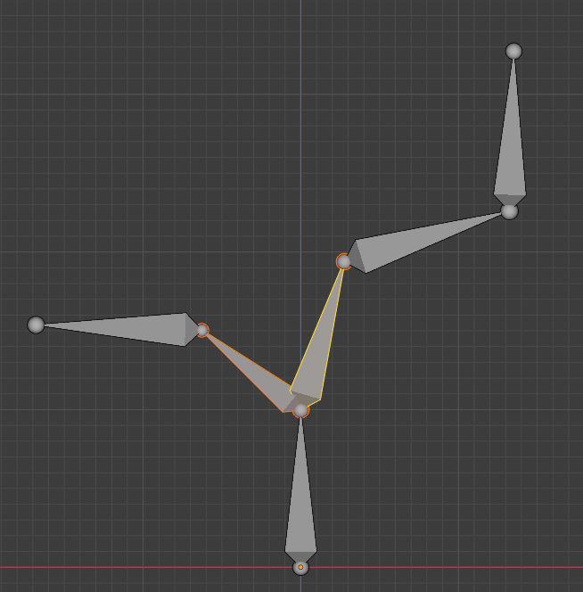

##################
Lesson 7 - Rigging
##################

****************
What is Rigging?
****************
Rigging is the process of creating a control structure for our Character that 
makes it easy to drive and animate its movements later on.

This control structure is called the **Rig** and its elements are organized in a
**Parent/Child - Hierarchy**. The way the different elements of the hierarchy
are able to move can be limited in different ways by using **Constraints** 

    example of a rig / character skeleton (Armature), here you see the
    Armature that drives the robot VIC shown in the render at the top.

Parenting
=========
Through Parenting we can assign an object as a child to another object making 
that object its parent. In this parent/child relationship the child object
now follows its parents transformations. When the Parent gets moved, scaled or
rotated the child will also get transformed accordingly. All the while the
childs transformation values (Location, Rotation, Scale) will not show this
transformation. Because they now display the distance to its Parent instead
of the 3D World Origin.

=========================== ==========================================
Hotkey                      Function
=========================== ==========================================
**Ctrl + P**                Parent selected objects to active object
**Alt + P**                 Unparent selected objects
=========================== ==========================================

Blender Manual Link:
    * `Blender Manual | Parenting Objects <https://docs.blender.org/manual/en/latest/scene_layout/object/editing/parent.html>`_
    * `Blender Manual | Parenting <https://docs.blender.org/manual/en/latest/animation/armatures/bones/editing/parenting.html>`_

Constraints
===========
Constraints limit the transformations an object can perform in a specific way.
It's possible to combine multiple Constraints to create very complex behaviour.

Constraints can be added to Objects and Bones like modifiers by opening the
|props_constraints| **Object Constrants Properties Panel**. The Constraints
system in blender follows the same rules as the modifier system in terms of
how the User Interface acts and feels.

Blender Manual Link:
    `Blender Manual | Constraints <https://docs.blender.org/manual/en/latest/animation/constraints/introduction.html>`_

Bones/Armature
==============
To build our Rig we will not use Mesh objects or other geometry we have been using
up until now, but a new kind of object called a **Bone**. With it we will construct
our characters **Skeleton or Armature**.

To start building we need to add an **Armature Object** to our scene. Add it by
pressing **Hotkey: Shift + A >> click on Armature**.

.. hint::
    The Armature object has 2 Modes we are interested in **Edit Mode** and 
    **Pose Mode** we can toggle between those two by pressing **Hotkey: Tab**.

    If you want to return to **Object Mode** try pressing **Hotkey: Ctrl + Tab**
    to open a **Pie Menu** where you can choose which mode you want to enter.

What is a Bone?
---------------
In most 3D Applications bones have a octahedral shape, and feature a **head and a
tail**. A Bone rotates around its **head** and always points to its **tail**.

   Image showing a single bone with its **head at the bottom** and its **tail at the top.**

**Armature Edit Mode Hotkeys:**

=========================== =============================================
Hotkey                      Function
=========================== =============================================
**E**                       Extrude Bone and form a chain
**Alt + P**                 Unparent selected objects
**Ctrl + P**                Set active bone as parent to selected bones
**Alt + F**                 Flip direction of selected bone (Head & Tail)
=========================== =============================================

With these tools we can build a hierarchy of bones consisting of **bone
chains**.

    Example of a bone hierarchy consiting of one root bone
    that acts as the parent of two separate bone chains.

.. hint:: 
    
    While building a complex hierarchy we sometimes need to rename a lot of bones.
    Luckily Blender has a batch rename tool that enables us to do just that.
    It is accessible via the **Hotkey: Ctrl + F2**

Blender Manual Link:
    `Blender Manual | Bones <https://docs.blender.org/manual/en/latest/animation/armatures/bones/introduction.html>`_

Skinning/Armature Modifier
==========================
Once we finished building our Armature we need to bind our character to it. This
process is called Skinning, we are binding our 3D Mesh Skin to our Rig/Bones.
Every Vertex of our 3D Mesh needs to be told which bone of our Armature it has
to follow, it can also follow multiple bones to a specific percentage. By giving
each vertex a specific weighting value for each bone we want to affect it we can
create smooth deformations of our 3D Mesh.

Blender provides the Armature Modifier for this purpose. We just need to add it
to our 3D Mesh Character and put our Armature in the **Armature slot**.

.. hint::
    A fast way to bind a 3D mesh to an Armature is by selecting the 3D mesh then
    the Armature and then pressing **Hotkey: Ctrl + P >> Select Armature Deform
    >> With Automatic Weights**

    This will add an Armature modifier to the mesh and add vertex weightings
    automatically that help get you started.

Blender Manual Link:
    `Blender Manual | Armature Modifier <https://docs.blender.org/manual/en/latest/modeling/modifiers/deform/armature.html>`_

Vertex Groups
-------------
Binding vertices to bones in done via **Vertex Groups** you can create them
in the |props_object_data| **Object Data Properties Panel**. To be able to
bind vertices to specific bones you need to create a **Vertex Group with 
the same name as the Bone in your Armature** for each Bone that should deform
the mesh. (This can also be done automatically for you by using the hint above)

You can add and remove Vertex Groups by pressing the **+** and **-** buttons on
the top right of the **Vertex Groups Rollout**.
Once you are in **Edit Mode** the GUI Elements at the bottom will be available.
There you can **Assign or Remove a specific Weight to the currently selected Vertices**.

.. |props_object_data| image:: ../_static/images/bl_gui_props_object_data.png

Blender Manual Link:
    `Blender Manual | Vertex Groups <https://docs.blender.org/manual/en/latest/modeling/meshes/properties/vertex_groups/introduction.html>`_

Showing Vertex weights on the Mesh
----------------------------------
To be able to see the influence of each bone on our mesh we have to enable some settings
in our 3D Viewport. Once we have done that the bones influence on each vertex will be
shown with a rainbow color gradient (0.0 = Black, 1.0 = Red).

Turn on **Vertex Group Weights** in the **3D Views Overlay Menu** (Top Right) and
**to make sure the Vertex Weight colors are clearly visible** set the **Viewport
Shading Color** to **Object**

Forward Kinematic / Inverse Kinematic (FK / IK)
===============================================
When we construct a bone chain all its bones are in Forward Kinematic mode, 
meaning to change the position of the last bone in the chain we have to 
rotate all the bones prior until we get the desired position.

This is useful in some and very cumbersome in other cases. That's why there
is another mode of operation that's implemented with constraints called
Inverse Kinematic. This Mode features an IK-Target which the whole bone 
chain will point to. For example a characters arm can be made to grab or
point at something by only moving the IK-Target and the bone chain will
follow.

.. raw:: html

    <video controls src="../_static/videos/bl_3dview_ikchain_demo.mp4"></video>

Bendy Bones
===========
Blender gives us the option to change simple normal bones into bendy bones. Bendy
Bones are bones with additional subsegments that can create arcs and bend similar
to a simple curve object when we change it's start and end point location.

.. raw:: html

    <video controls src="../_static/videos/bl_3dview_bendybones_demo.mp4"></video>

We can enable Bendy bones by opening the **Bone Object Property Rollout** in the
**Properties Panel** and changing the **Segments Parameter**.
Additionally if we want to be able to control the bendy bones curve easily we can
assign other bones as **custom Start and End Handle** at the bottom of the rollout.

.. image:: ../_static/images/bl_gui_props_object_data_bone.png

.. hint::
    to be able to see the subsegments of the Bendy bones we have to change the 
    Display Mode of our Armature to **B-Bone**

    .. image:: ../_static/images/bl_gui_props_object_data_armature_bbone.png

Rig Examples
============

FootRoll Leg Rig
----------------
Great for Humanoid characters that need a convenient to animate footroll mechanic.

Download:
    :download:`FootRoll-Rig Example <../_static/downloads/rig_example_foot.blend>`

Bendy Bones IK Arm Rig
----------------------
Noodly Arm that can bend once driven by an IK Chain with Stretch and Bendy Bones

Download:
    :download:`Bendy Bones IK Arm Rig Example <../_static/downloads/rig_example_bendy_stretchy_IK_arm.blend>`

Spline IK Arm Rig
-----------------
Noodly Arm that can bend in multiple different direction driven by a spline Curve.

Download:
    :download:`Spline IK Arm Rig Example <../_static/downloads/rig_example_splineIK_arm.blend>`

Tank Treads Rig
---------------
Tank Treads Rig building on the Tank Tread tutorial from an earlier lesson

Download:
    :download:`Tank Treads Rig Example <../_static/downloads/rig_example_treads.blend>`
