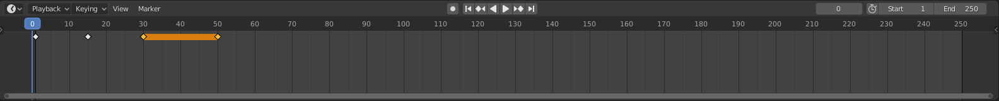
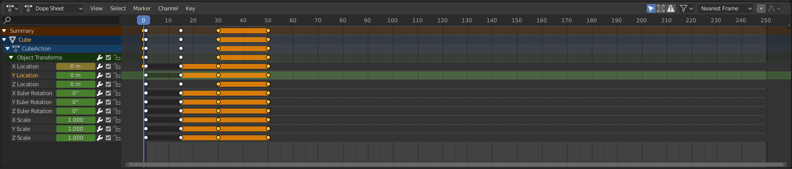
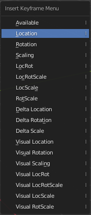
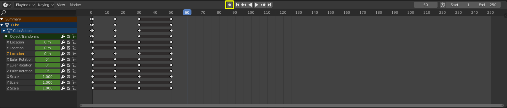
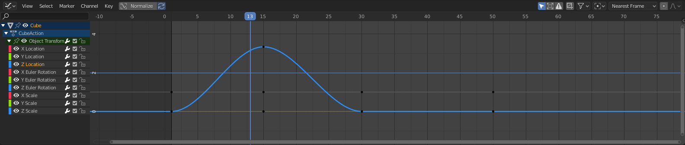
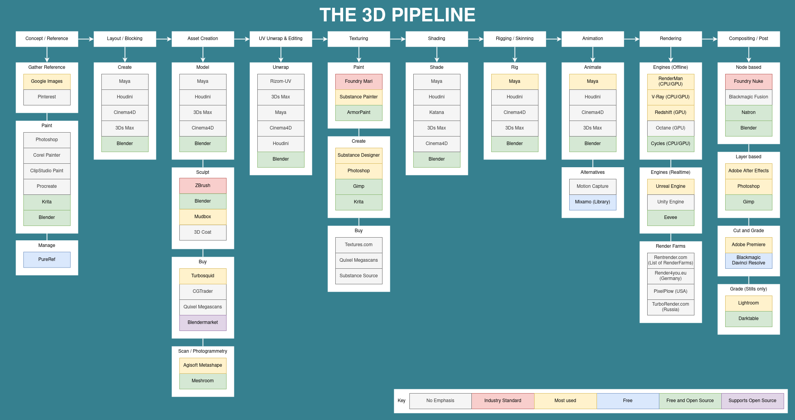

########################################
Lesson 8 - Animation and the 3D Pipeline
########################################

********************
Animation in Blender
********************

Time
====
Animation is a change of states over a certain amount of time. To create
the illusion of movement on film we need to show the human eye a certain
number of images per second. It turns out that at about 24 frames per 
second the human eye doesn't see the single images anymore but perceives
the different images as a fluid movement instead. A flipbook is the most
basic example of this behaviour.

To create animation we therefore need to create multiple images within our
3D Software that when played back at the speed of 24 frames per second (fps)
will be perceived as a "moving image" / movie.

In Blender the default playback speed or fps is set to 24 frames by default.
When you hit **Hotkey: Spacebar** in Blender to move the Playhead (Blue in
the image below) in the timeline it will move with a speed of 24 frames per
second.

    
    Blenders Timeline Editor with the blue Playhead and a few diamond shaped
    grey and yellow Keyframes.

Blender Manual Link:
    * `Blender Manual | Animation <https://docs.blender.org/manual/en/latest/animation/introduction.html>`_

Animation Links:
    * `graphixly | 12 Principles of Animation <https://graphixly.com/blogs/news/12-principles-of-animation>`_
    * `creativebloq | 12 Principles of Animation <>https://www.creativebloq.com/advice/understand-the-12-principles-of-animation`_

Timeline / Dopesheet
====================
The Timeline and Dopesheet Editor in Blender give us a quick overview of the
Keyframes that are on the objects we have selected in the **3D View**.
The Timeline contains a simple onedimensional graph that in its x-axis displays
the frame numbers. With the blue Playhead we can select the frame we want to
view in our **3D Viewport**. Once we have set Keyframes and placed them at specific
frames in our timeline we will also be able to observe interpolated changes between
them in the **3D View**.

    Blenders Dopesheet Editor looks very similar to the Timeline Editor but gives
    us access to different useful tools and shows the state of keyframes with different
    shapes (circles, rectangles, etc.)

Blender Manual Link:
    * `Blender Manual | Timeline Editor <https://docs.blender.org/manual/en/latest/editors/timeline.html>`_
    * `Blender Manual | Dopesheet Editor <https://docs.blender.org/manual/en/latest/editors/dope_sheet/introduction.html>`_

Keyframes
=========
**Keyframes** contain states of how you want objects and parameters to be at a
point in time. We can set Keyframes in Blender by pressing **Hotkey: I** and
selecting which parameters we want to key from the floating menu that pops up.
The keyframe recording the current state of the selected object will be inserted
into the timeline at the frame that is currently selected with the blue Playhead.

Instead of using this manual way of inserting keyframes we can also use **AutoKey Mode**.
When **Autokey Mode** is on every time we make a change to a parameter of an object, that
is animateable Blender will automatically insert a keyframe at the position of the playhead.

.. note::
    While animating try to make changes in the following order to prevent errors:
        * Move the Playhead to the frame you want to insert the keyframe at
        * Make the changes to the parameters you want to animate (Position, Rotation, Scale, etc.)
        * Insert the Keyframe (or have it automatically inserted by Autokey Mode)

Blender Manual Link:
    * `Blender Manual | Keyframes <https://docs.blender.org/manual/en/latest/animation/keyframes/introduction.html>`_

Graph Editor
============
If we want more control over how the 3D Software interpolates between our created
keyframes we can use the **Graph Editor**. The Graph Editor shows us the Function
Curves (F-Curves) of the animation. Its 2-Dimensional graph plots the current frame
on the X-Axis and the values of the selected channel on the Y-Axis. This means the
curves in the **Graph Editor** are graphing how fast the values between two keyframes
are changing. The slope of the graph shows us the rate of change, the steeper the faster
the values increase or decrease the shallower the slope the slower the values increase or
decrease.

    Blenders Graph Editor showing multiple F-Curves in it 2 dimensional x-y-graph.

Blender Manual Link:
    * `Blender Manual | Graph Editor <https://docs.blender.org/manual/en/latest/editors/graph_editor/introduction.html>`_

****************************
The 3D Pipeline and Software
****************************
Below is a graphic showing all the steps of the 3D Pipeline for creating an animated 
movie. Most VFX or Animation Movie production crews follow the steps and use the
software listed in the image below.
You can use the chart to find software packages for each step in the pipeline or
other resources that are very useful for the completion of each stage.

The chart always lists at least one free or open source software package for each
of the steps of the pipeline if you want to try it out first without investing any
money.

*********
Resources
*********

Blender Training:
    * `blenderartists.org <https://blenderartists.org/>`_
    * `blendermarket.com <https://blendermarket.com/categories/video-tutorials>`_
    * `blendernation.com <https://www.blendernation.com/>`_
    * `cgcookie.com <https://cgcookie.com/>`_
    * `Blender Cloud <https://cloud.blender.org/welcome/>`_
    * `Blender Cloud | Animation Fundamentals <https://cloud.blender.org/training/animation-fundamentals/>`_
    * `Youtube Learn | Grease Pencil <https://www.youtube.com/watch?v=9N-glGarYuM>`_

Training by industry professionals:
    * `Concept Artist Jama Jurabaev | Blender <https://gumroad.com/jamajurabaev?sort=newest>`_
    * `Gnomon Workshop <khttps://www.thegnomonworkshop.com>`_

Gameart / Gamedev:
    * `polycount.com <https://polycount.com/>`_
    * `polycount wiki <http://wiki.polycount.com/wiki/Polycount>`_
    * `gamedev.net <https://www.gamedev.net/>`_

Porfolio websites:
    * `Artstation <https://artstation.com/>`_
    * `Behance <https://behance.net/>`_
    * `Deviant art <https://deviantart.com/>`_

Lighting:
    * `Chris Brejon | CG Cinematography <https://chrisbrejon.com>`_
    * `Safaribooks | Light - Science and Magic <https://learning.oreilly.com/library/view/light-science-and/9780240812250/>`_

Substance Designer:
    * `Josh Lynch | Artstation <https://www.artstation.com/joshlynch>`_
    * `Josh Lynch | GDC 2018 Middle-Earth:Shadow of War <https://www.youtube.com/watch?v=TeMCtK1llIM>`_
    * `Substance Source <https://source.substance3d.com/>`_

Sculpting:
    * `ZbrushCentral <https://www.zbrushcentral.com/>`_
    * `ZClassroom | Free ZBrush Training <http://pixologic.com/zclassroom/>`_
    * `Ryan Kingslien | Sculpt Face using Ecorche <https://www.youtube.com/watch?v=gZEs5x9jL8E>`_ (Good Zbrush and general sculpting youtube channel)
    * `Yan Sculpts | Blender sculpting youtube channel <https://www.youtube.com/c/yansculpts>`_

